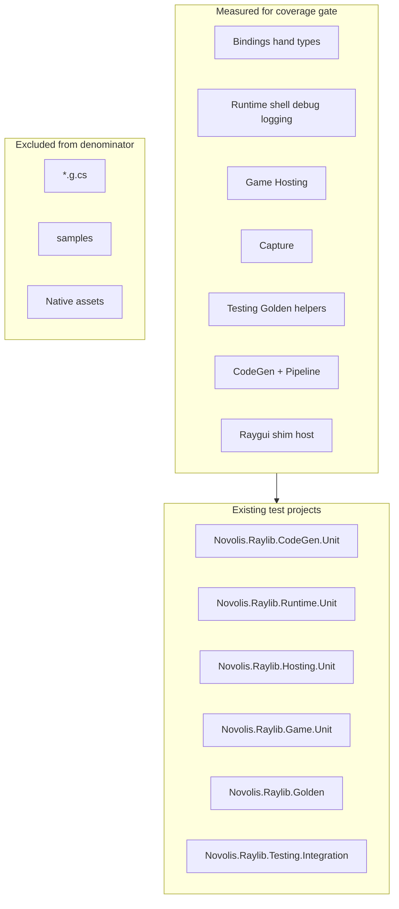

# ~100% C# coverage plan

## Default scope (user did not specify; adjust if you want literal `*.g.cs` included)

| In scope | Out of scope |
|----------|--------------|
| Hand-written `.cs` in [`src/`](src/) and [`codegen/`](codegen/) | [`*.g.cs`](src/Novolis.Raylib.Bindings/Interop/) (covered by codegen drift + golden, not line coverage) |
| [`Novolis.Raylib.Testing`](src/Novolis.Raylib.Testing/) (test-support package) | [`samples/`](samples/) |
| CLI logic testable via extracted helpers | Thin `Program.cs` `Main` wrappers (smoke-only) |
| | [`Novolis.Raylib.Native`](src/Novolis.Raylib.Native/) (no C#) |

**Rationale:** ~60%+ of product surface area is generated façades/interop. Chasing line coverage on `Graphics.g.cs` adds noise; manifests + golden already guard behavior. Target **~100% on hand-written code** (~150 files across `src` + `codegen`).



---

## Phase 0: Coverage infrastructure

### 0.1 Add coverlet + central config

- Add to [`Directory.Packages.props`](Directory.Packages.props): `coverlet.collector` (and optionally `coverlet.msbuild`).
- Add [`build/Novolis.Raylib.Coverage.props`](build/Novolis.Raylib.Coverage.props) imported by test projects:

```xml
<PropertyGroup>
  <CollectCoverage>true</CollectCoverage>
  <CoverletOutputFormat>cobertura,json</CoverletOutputFormat>
  <CoverletOutput>$(MSBuildThisFileDirectory)../artifacts/coverage/</CoverletOutput>
  <ExcludeByFile>$(MSBuildThisFileDirectory)../**/*.g.cs</ExcludeByFile>
  <ExcludeByAttribute>Obsolete,GeneratedCode,CompilerGenerated</ExcludeByAttribute>
</PropertyGroup>
```

- Reference `coverlet.collector` in all [`tests/*/*.csproj`](tests/) via the shared props file.

### 0.2 Local script + report

Add [`scripts/run-coverage.ps1`](scripts/run-coverage.ps1):

```powershell
dotnet test Novolis.Raylib.slnx -c Release --filter "Category!=Native" --collect:"XPlat Code Coverage"
# merge + html via reportgenerator (dotnet tool, local only)
```

Output: `artifacts/coverage/index.html` + `coverage-summary.json` for CI.

### 0.3 CI job

New job in [`.github/workflows/ci.yml`](.github/workflows/ci.yml): `coverage` (Windows, after `step_01_source` + `step_02_native` like `build-test`):

1. Run all non-Native tests with coverage collection.
2. Run golden tests separately (already native-gated) and **merge** coverage files.
3. Compute line rate on **included assemblies only**.
4. Fail if below threshold (start **70%**, ratchet +5% per milestone PR until **95%**).

Upload `artifacts/coverage/` on failure for inspection.

### 0.4 Coverage exclusions file

Add [`coverage.runsettings`](coverage.runsettings) or MSBuild item list documenting exclusions:

- `**/*.g.cs`
- `**/samples/**`
- `codegen/**/Program.cs` (optional; or test CLI via integration)

Document policy in [`docs/testing.md`](docs/testing.md) new **Coverage** section.

---

## Phase 1: Baseline + gap report (no new tests yet)

Run coverage once locally and produce an assembly-level heat map. Expected **lowest** assemblies today:

| Assembly | Current tests | Main gaps |
|----------|---------------|-----------|
| [`Novolis.Raylib.Pipeline`](codegen/Novolis.Raylib.Pipeline/) | 2 tests in [`PipelineStepResultTests.cs`](tests/Novolis.Raylib.CodeGen.Unit/PipelineStepResultTests.cs) | All 8 steps, `PipelineRunner`, skip/fail paths |
| [`Novolis.Raylib.CodeGen`](codegen/Novolis.Raylib.CodeGen/) | ~10 test classes | Emitters (template matrix), `Program` commands, verifiers edge cases |
| [`Novolis.Raylib.Capture`](src/Novolis.Raylib.Capture/) | None dedicated | `FrameCaptureSession`, `FrameCapturePipeline`, stream options |
| [`Novolis.Raylib.Testing`](src/Novolis.Raylib.Testing/) | Golden unit tests cover ~5 types | ~35 files mostly untested (harness, polling, layouts, publisher edge cases) |
| [`Novolis.Raylib.Runtime`](src/Novolis.Raylib.Runtime/) (hand) | Headless shell only | `ImguiShimHost`, `RaylibTraceHost`, `Logger`, `RaylibDebug`, `GuiControls`, presentation hooks |
| [`Novolis.Raylib.Bindings`](src/Novolis.Raylib.Bindings/) (hand) | Interop optimization/reflection | `Utf8StringMarshaller`, `Camera`, `Texture`, `RaylibColor` conversions |
| [`Novolis.Raylib.Hosting`](src/Novolis.Raylib.Hosting/) | 1 DI registration test | `RaylibHostedLoopService` loop models, startup/shutdown, event-loop invalidation |
| [`Novolis.Raylib.Game`](src/Novolis.Raylib.Game/) | Headless `Run` only | `RayGameContext`, diagnostics, `SmoothedFps` |
| [`Novolis.Raylib.Raygui`](src/Novolis.Raylib.Raygui/) | None | `RayguiShimHost`, `RayGuiControls`, PostBind |

Commit baseline `artifacts/coverage/baseline-summary.json` (or CI artifact only) to track progress.

---

## Phase 2: New / expanded test projects

Keep TUnit + existing patterns. Add projects only where references stay clean:

| New project | References | Purpose |
|-------------|------------|---------|
| **`tests/Novolis.Raylib.Pipeline.Unit`** | `Novolis.Raylib.Pipeline`, `Novolis.Raylib.CodeGen` | Isolated pipeline step tests (recommended split from bloated CodeGen.Unit) |
| **`tests/Novolis.Raylib.Capture.Unit`** | `Novolis.Raylib.Capture`, `Novolis.Raylib.Testing` | Capture without full game stack |
| **`tests/Novolis.Raylib.Testing.Unit`** | `Novolis.Raylib.Testing` only | Pure helpers (no native): layouts, publisher, polling, gate |

Add to [`Novolis.Raylib.slnx`](Novolis.Raylib.slnx).

**Do not** add tests under `src/` — keep [`Novolis.Raylib.Testing`](src/Novolis.Raylib.Testing/) as the shared harness package.

---

## Phase 3: Fill gaps by area (priority order)

### 3.1 Codegen + Pipeline (highest ROI, no native)

**Pipeline** — new [`tests/Novolis.Raylib.Pipeline.Unit/`](tests/Novolis.Raylib.Pipeline.Unit/):

- **`PipelineRunner`**: success chain, fail-fast stops downstream, writes `result.json` + `step.log`.
- **`StepSkipEvaluator`**: force vs skip, missing output, changed input hash (extend existing tests).
- **Per-step tests** using temp repo fixture under `Path.GetTempPath()`:
  - `step_03_verify_manifest`: fake `raylib.h` + manifest row → pass/fail.
  - `step_04_enrich_docs` / `step_05_verify_docs`: minimal façade manifest fixtures.
  - `step_06_codegen`: assert output files + ManifestSha256 headers.
  - `step_07_drift`: mock git or run in temp git repo.
  - `step_01_source`: mock HTTP with `HttpMessageHandler` stub (extract handler from [`SourceStep.cs`](codegen/Novolis.Raylib.Pipeline/Steps/SourceStep.cs) for testability).
  - `step_02_native`: skip on CI without cmake; mark `[Explicit]` or run only when `NOVOLIS_RAYLIB_NATIVE_TESTS=1`.

**CodeGen** — extend [`tests/Novolis.Raylib.CodeGen.Unit/`](tests/Novolis.Raylib.CodeGen.Unit/):

- **Emitter template matrix**: one test per `RaylibInteropEmitter` template branch (or grouped by signature family).
- **`RaylibManifestVerifier`**: missing header skip, missing symbol fail.
- **`RaylibManifestSuggester`**: with temp header fixture.
- **`FacadeDocEnricher` / `FacadeDocVerifier`**: minimal manifests.
- **`RaylibCodegenPipeline.GenerateBindingsOnly`**: smoke all emit phases.
- **Hooks**: already covered in [`RaylibCodegenHookTests.cs`](tests/Novolis.Raylib.CodeGen.Unit/RaylibCodegenHookTests.cs); add negative paths.

**Refactor for testability (small, targeted):**

- Extract `IProcessRunner` from [`ProcessRunner.cs`](codegen/Novolis.Raylib.Pipeline/ProcessRunner.cs) for `step_02` / `step_08` / drift git calls.
- Extract `ISourceFetcher` or inject `HttpMessageHandler` in `SourceStep`.

### 3.2 Novolis.Raylib.Testing (pure unit, no GLFW)

New **`Novolis.Raylib.Testing.Unit`** covering:

- [`GoldenAdhocRunBucketLayout`](src/Novolis.Raylib.Testing/Golden/GoldenAdhocRunBucketLayout.cs), [`GoldenRenderOutputLayout`](src/Novolis.Raylib.Testing/Golden/GoldenRenderOutputLayout.cs)
- [`GoldenTestGate`](src/Novolis.Raylib.Testing/Golden/GoldenTestGate.cs), [`GoldenTestPolling`](src/Novolis.Raylib.Testing/Golden/GoldenTestPolling.cs)
- [`GoldenArtifactPublisher`](src/Novolis.Raylib.Testing/Golden/GoldenArtifactPublisher.cs) (extend existing golden tests)
- [`DeterministicFrameClock`](src/Novolis.Raylib.Testing/DeterministicFrameClock.cs) (partially in integration)
- [`DelegateRaylibFrameRenderer`](src/Novolis.Raylib.Testing/DelegateRaylibFrameRenderer.cs), [`SimulatedInput`](src/Novolis.Raylib.Testing/SimulatedInput.cs)

Use temp directories under `temp/test-renders/` (already gitignored).

### 3.3 Bindings hand-written types

Extend **CodeGen.Unit** or add **`Novolis.Raylib.Bindings.Unit`**:

- [`Utf8StringMarshaller`](src/Novolis.Raylib.Bindings/Interop/Utf8StringMarshaller.cs): round-trip, null, free.
- [`RaylibColor`](src/Novolis.Raylib.Bindings/Interop/RaylibColor.cs), [`Camera`](src/Novolis.Raylib.Bindings/Rendering/Camera.cs), [`Texture`](src/Novolis.Raylib.Bindings/Rendering/Texture.cs): layout/size (extend [`RaylibInteropOptimizationTests`](tests/Novolis.Raylib.CodeGen.Unit/RaylibInteropOptimizationTests.cs)).

### 3.4 Capture

New **`Novolis.Raylib.Capture.Unit`**:

- [`FrameCaptureSession`](src/Novolis.Raylib.Capture/FrameCaptureSession.cs) / [`FrameCapturePipeline`](src/Novolis.Raylib.Capture/FrameCapturePipeline.cs): subscribe to [`RaylibPresentationHooks`](src/Novolis.Raylib.Runtime/Presentation/RaylibPresentationHooks.cs) with fake frames (no native).
- [`CaptureStreamOptions`](src/Novolis.Raylib.Capture/CaptureStreamOptions.cs), [`RaylibCaptureRuntimeState`](src/Novolis.Raylib.Capture/RaylibCaptureRuntimeState.cs): AsyncLocal scope tests (mirror [`RaylibTestRuntimeStateTests`](tests/Novolis.Raylib.Runtime.Unit/RaylibTestRuntimeStateTests.cs)).

Integration already has [`XFighterCaptureTests`](tests/Novolis.Raylib.Testing.Integration/XFighterCaptureTests.cs) — keep for end-to-end, unit for logic.

### 3.5 Runtime, Game, Hosting (headless first)

**Runtime.Unit** — add tests with `NOVOLIS_RAYLIB_HEADLESS=1`:

- [`Logger`](src/Novolis.Raylib.Runtime/Logging/Logger.cs) / [`RaylibTraceHost`](src/Novolis.Raylib.Runtime/RaylibTraceHost.cs): callback registration without native.
- [`RaylibPresentationHooks.Notify`](src/Novolis.Raylib.Runtime/Presentation/RaylibPresentationHooks.cs): subscriber add/remove.
- [`GuiControls`](src/Novolis.Raylib.Runtime/Gui/GuiControls.cs): pure logic paths if any; else `[RunOnlyIfNativeRaylib]` smoke.

**Hosting.Unit** — expand:

- [`RaylibHostedLoopService`](src/Novolis.Raylib.Hosting/RaylibHostedLoopService.cs): use fake `IRaylibShellRuntime` that invokes `IRaylibFrameRenderer` once; verify `IStartupSystem` / `IShutdownSystem` / `IUpdateSystem` / `IRenderSystem` invocation order.
- Event-loop model with [`IRaylibInvalidationSource`](src/Novolis.Raylib.Abstractions/IRaylibInvalidationSource.cs).

**Game.Unit** — expand:

- [`RayGameContext`](src/Novolis.Raylib.Game/RayGame.cs) resize/dt helpers.
- [`SmoothedFps`](src/Novolis.Raylib.Game/SmoothedFps.cs), [`DiagnosticsOverlay`](src/Novolis.Raylib.Game/DiagnosticsOverlay.cs) (pure math/rendering prep where possible).

### 3.6 Raygui + native-only paths

- **Headless:** [`RayGuiControls`](src/Novolis.Raylib.Raygui/RayGuiControls.cs) unit tests with mocked shim delegates if extractable.
- **Native-gated** (`[Category("Native")]` + `[RunOnlyIfNativeRaylib]`): [`ImguiShimHost`](src/Novolis.Raylib.Runtime/ImguiShimHost.cs), [`RayguiShimHost`](src/Novolis.Raylib.Raygui/RayguiShimHost.cs) — load DLL in Windows CI only.

Run these in **`golden-tests`** job or a dedicated **`native-unit`** job (same prerequisites: `step_01` + `step_02`).

---

## Phase 4: Enforcement strategy (ratchet)

Do **not** jump to 100% threshold in one PR.

| Milestone | Line coverage target (hand-written) | Gate |
|-----------|-------------------------------------|------|
| M1 | Baseline measured | Report only, no fail |
| M2 | 70% | CI fail below |
| M3 | 85% | CI fail below |
| M4 | 95%+ | CI fail below; allow `[ExcludeFromCodeCoverage]` only with justification comment |

Use **per-assembly** reports in PR comments (optional: `codecov` or artifact HTML) to prevent one assembly masking another.

---

## Phase 5: What will NOT reach 100% (document, do not chase)

- **P/Invoke into raylib** without native loaded — cover via golden + native-gated smokes, not line coverage.
- **`step_02_native` cmake paths** on Linux agents without full toolchain — `[Explicit]` or Windows-only job.
- **CLI `Program.Main` help/unknown command** — one smoke test each, not every string branch.
- **Generated façades** — excluded; behavior covered by golden stories ([`tests/Novolis.Raylib.Golden/`](tests/Novolis.Raylib.Golden/)).

---

## Suggested implementation order (PRs)

1. **Infrastructure only**: coverlet props, script, CI report job, docs — no new tests.
2. **Testing.Unit + Capture.Unit**: pure helpers, fast win.
3. **Pipeline.Unit + CodeGen emitter matrix**: maintainer tooling coverage.
4. **Bindings + Runtime headless**: expand existing unit projects.
5. **Hosting + Game loop fakes**: medium effort.
6. **Native-gated shim tests**: Windows CI job alignment.
7. **Ratchet threshold** to 85% → 95%.

---

## Key files to touch

- [`Directory.Packages.props`](Directory.Packages.props), new [`build/Novolis.Raylib.Coverage.props`](build/Novolis.Raylib.Coverage.props)
- [`scripts/run-coverage.ps1`](scripts/run-coverage.ps1), [`.github/workflows/ci.yml`](.github/workflows/ci.yml)
- [`docs/testing.md`](docs/testing.md), [`agentic-tools/registry.json`](agentic-tools/registry.json) (`coverage.run` tool)
- New test projects under [`tests/`](tests/)
- Small testability extractions in [`codegen/Novolis.Raylib.Pipeline/`](codegen/Novolis.Raylib.Pipeline/) (interfaces for process/HTTP)
