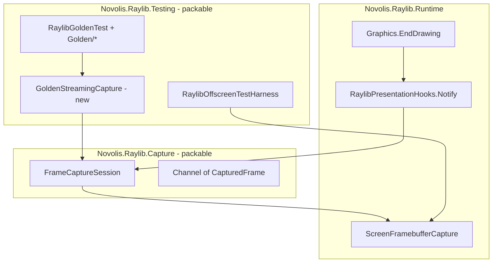

# Capture package refactor plan

## Goals

1. **`Novolis.Raylib.Capture`** — packable, general-purpose framebuffer streaming (games, tools, future recording).
2. **`Novolis.Raylib.Testing`** — all golden QA, harness, artifact paths, and test-only streaming glue.
3. **`Novolis.Raylib` meta** — does **not** reference Capture (per your choice); apps add Capture explicitly when needed.
4. **Testing** still gets Capture **transitively** via `ProjectReference` on `Novolis.Raylib.Testing`.

## Current state

| Location | What it does |
|----------|----------------|
| [`RaylibFrameCaptureHub`](src/Novolis.Raylib.Runtime/Internal/RaylibFrameCaptureHub.cs) | Internal hook; called from generated [`Graphics.EndDrawing`](src/Novolis.Raylib.Runtime/Rendering/Graphics.g.cs) |
| [`Novolis.Raylib.Capture`](src/Novolis.Raylib.Capture/) | `FrameCaptureSession`, PNG streaming via channel; **`IsPackable=false`**; uses `InternalsVisibleTo` from Runtime |
| [`ScreenFramebufferCapture`](src/Novolis.Raylib.Runtime/Rendering/ScreenFramebufferCapture.cs) | Low-level PNG export (stays **Runtime**) |
| [`Novolis.Raylib.Testing/Golden/*`](src/Novolis.Raylib.Testing/Golden/) | Golden tests, HTML reports, layouts — already correct home |
| [`RaylibGoldenTest`](src/Novolis.Raylib.Testing/Golden/RaylibGoldenTest.cs) | Creates `FrameCaptureSession` when `EnableStreamingCapture` but **never reads** `Reader` — incomplete test glue |

Capture has **no** golden-specific code today; the work is boundaries, packaging, and API visibility.



---

## Layer 1: Public presentation hook (Runtime)

**Problem:** Capture today depends on `internal` hub + `InternalsVisibleTo` — inappropriate for a published package.

**Change:** Replace internal hub with a small **public** API in Runtime (no reference to Capture):

- Add [`RaylibPresentationHooks`](src/Novolis.Raylib.Runtime/) (name can be `RaylibFramePresentation`):
  - `Register(Action? onFramePresented, bool enabled)` or equivalent multicast
  - `Notify()` — same zero-cost volatile gate as today
- Update [`InjectEndDrawingNotifyHook`](codegen/Novolis.Raylib.CodeGen.Hooks/InjectEndDrawingNotifyHook.cs) to emit `RaylibPresentationHooks.Notify()` instead of `RaylibFrameCaptureHub.Notify()`.
- Regenerate [`Graphics.g.cs`](src/Novolis.Raylib.Runtime/Rendering/Graphics.g.cs) via `dotnet run --project codegen/Novolis.Raylib.CodeGen -- generate`.
- Delete [`RaylibFrameCaptureHub.cs`](src/Novolis.Raylib.Runtime/Internal/RaylibFrameCaptureHub.cs) after migration.
- Remove `InternalsVisibleTo` for Capture from [`Novolis.Raylib.Runtime.csproj`](src/Novolis.Raylib.Runtime/Novolis.Raylib.Runtime.csproj).

**Codegen tests:** Update [`RaylibCodegenHookTests`](tests/Novolis.Raylib.CodeGen.Unit/RaylibCodegenHookTests.cs) / pipeline expectations to match new type name.

---

## Layer 2: Packable `Novolis.Raylib.Capture`

### Project / NuGet

Update [`Novolis.Raylib.Capture.csproj`](src/Novolis.Raylib.Capture/Novolis.Raylib.Capture.csproj):

- `Import` [`build/Novolis.Raylib.Packaging.props`](build/Novolis.Raylib.Packaging.props)
- `IsPackable=true`, `PackageId=Novolis.Raylib.Capture`
- Description: opt-in per-frame framebuffer capture (streaming channel); foundation for clips/recording later
- Add [`README.md`](src/Novolis.Raylib.Capture/README.md) with install + minimal `FrameCaptureSession` sample
- Keep **single** project reference: `Novolis.Raylib.Runtime` (Native flows transitively)
- Remove `InternalsVisibleTo` for Testing

Add to [`scripts/pack-all.ps1`](scripts/pack-all.ps1) after Runtime (before or after Testing).

### API cleanup (public surface)

| Type | Action |
|------|--------|
| `FrameCaptureSession` | Keep as primary entry (`IDisposable`, `Reader`) |
| `CaptureStreamOptions` | Keep; document thread/render-thread rules |
| `CapturedFrame` | Keep; document PNG bytes today, RGBA later |
| `RaylibCaptureRuntimeState` | Keep `Enter` scope for nested sessions |
| `FrameCaptureService` | Rename/make **public** as `FrameCapturePipeline` **or** fold into `FrameCaptureSession` and delete `internal` type — avoid two hidden entry points |

**Hook wiring:** `FrameCaptureSession` constructor calls `RaylibPresentationHooks.Register(OnFramePresented, enabled: true)`; `Dispose` unregisters.

**Non-goals in this PR:** MP4/FFmpeg, RGBA path, RenderTexture capture (future `Recording` package builds on Capture).

---

## Layer 3: Testing-specific work stays in Testing

### Move / isolate golden streaming glue

- Add [`GoldenStreamingCapture.cs`](src/Novolis.Raylib.Testing/Golden/GoldenStreamingCapture.cs) (or similar):
  - Wraps `FrameCaptureSession` + optional background drain
  - v1 behavior: on dispose, write captured PNGs under story folder as `{frameIndex:D4}.png` **or** document as no-op until drain implemented
  - Removes raw `FrameCaptureSession` usage from [`RaylibGoldenTest.cs`](src/Novolis.Raylib.Testing/Golden/RaylibGoldenTest.cs)

- **`GoldenRunOptions.EnableStreamingCapture`** stays on Testing options but only Testing constructs `GoldenStreamingCapture` — not a Capture concern.

### Already correct in Testing (no move)

- Entire [`Golden/`](src/Novolis.Raylib.Testing/Golden/) folder (spec, reports, layouts, publisher, etc.)
- [`VisualCaptureArtifacts`](src/Novolis.Raylib.Testing/VisualCaptureArtifacts.cs), harness, `RaylibTestRuntime`, hosting test host
- [`RaylibOffscreenTestHarness`](src/Novolis.Raylib.Testing/RaylibOffscreenTestHarness.cs) continues using `ScreenFramebufferCapture` for single-frame PNG (appropriate for tests)

### Testing package reference

[`Novolis.Raylib.Testing.csproj`](src/Novolis.Raylib.Testing/Novolis.Raylib.Testing.csproj): keep `ProjectReference` to Capture; consumers of Testing get Capture transitively for test code that uses streaming.

---

## Layer 4: Docs and repo metadata

| File | Update |
|------|--------|
| [`AGENTS.md`](AGENTS.md) | Capture = packable optional; Testing = golden/harness only |
| [`README.md`](README.md) | Mermaid + table row for `Novolis.Raylib.Capture` (optional, not in meta) |
| [`docs/testing.md`](docs/testing.md) | Capture = general streaming; golden = Testing; fix “internal” wording |
| [`src/Novolis.Raylib.Testing/README.md`](src/Novolis.Raylib.Testing/README.md) | Mention transitive Capture for streaming; golden owns QA HTML |
| [`docs/getting-started.md`](docs/getting-started.md) | Optional: `dotnet add Novolis.Raylib.Capture` for frame streaming |

**Consumer guidance (AGENTS / Capture README):**

- Games/tools: `Novolis.Raylib` + `Novolis.Raylib.Capture`
- Test projects: `Novolis.Raylib.Testing` only (Capture transitive)
- Do not put golden types in Capture

---

## Layer 5: Sample (optional but valuable)

Add [`samples/HelloCapture`](samples/HelloCapture/) — short `RayGame` or shell loop that:

1. Starts `FrameCaptureSession`
2. Runs ~2 seconds
3. Drains `Reader` and writes frames to `artifacts/capture/`

Reference `Novolis.Raylib` + `Novolis.Raylib.Capture`; add to `Novolis.Raylib.slnx`.

---

## Verification

```bash
dotnet run --project codegen/Novolis.Raylib.CodeGen -- generate
pwsh ./scripts/agent-verify.ps1
dotnet build Novolis.Raylib.slnx -c Release
dotnet test --project tests/Novolis.Raylib.Golden/Novolis.Raylib.Golden.csproj -c Release
dotnet test --project tests/Novolis.Raylib.CodeGen.Unit/Novolis.Raylib.CodeGen.Unit.csproj -c Release
pwsh ./scripts/pack-all.ps1
# Confirm artifacts/Novolis.Raylib.Capture.*.nupkg exists
```

---

## Out of scope (follow-up)

- `Novolis.Raylib.Recording` (MP4 / encoder natives)
- RGBA frames and async encoder thread
- RenderTexture-based capture (manifest/façade exports)
- Adding Capture to meta package
