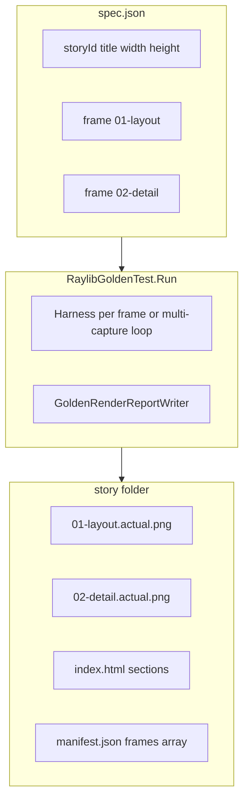

# Golden QA reports: SCR styling + multi-frame stories

## Goals

1. **HTML** matches Star Conflicts Revolt [`RaylibGoldenStoryWriter`](D:/github/StarConflictsRevolt/tests/StarConflictsRevolt.Tests.Unit/Client/Raylib/RaylibGoldenStoryWriter.cs): dark theme, stacked `<section>` per visual step, run meta header, footer with reproduce steps.
2. **Multiple frames per story** in one `index.html` (like SCR `01-galaxy` / `02-production` / `03-system`), driven by committed `spec.json` and written to the same `temp/test-renders/.../renders/{storyId}/` folder.
3. **Backward compatible**: existing single-frame goldens (`baseline.png`, story-level `expectations`, `baselineSha256`) keep working without migration.

---

## Current vs target

| Aspect | Today | Target |
|--------|-------|--------|
| Theme | Light table | SCR dark sections (`#0d1117`, `#161b22`, `.ok` / `.skip` / `.fail`) |
| Frames | Harness runs `maxFrames` but only **last** PNG kept (`actual.png`) | One section + PNG pair per **frame** in spec |
| Spec | Story-level `expectations`, one `baselineSha256` | `frames[]` with per-frame title, caption, expectations, hash |
| Assert | One SHA256 vs `baseline.png` | Per-frame SHA256 vs `{frameId}.png` in `Goldens/{storyId}/` |
| HTML | 1 row table | N sections (SCR order), optional story intro in header |



---

## Layer 1: Spec schema (v2, backward compatible)

### New type: `GoldenFrameSpec` in [`GoldenStorySpec.cs`](src/Novolis.Raylib.Testing/Golden/GoldenStorySpec.cs)

```json
{
  "schemaVersion": 2,
  "storyId": "raylib-golden-smoke-scene",
  "title": "2D smoke scene",
  "width": 320,
  "height": 240,
  "frames": [
    {
      "frameId": "01-layout",
      "title": "Full layout",
      "caption": "Panels, circle, and HUD text.",
      "captureAtFrame": 1,
      "maxFrames": 1,
      "baselineSha256": "…",
      "expectations": [
        "Background fill is RayWhite.",
        "…"
      ]
    }
  ]
}
```

| Field | Purpose |
|-------|---------|
| `frameId` | Kebab-case file prefix (`01-layout`); sort order for HTML |
| `title` / `caption` | Section `h2` and description (SCR parity) |
| `captureAtFrame` | 1-based index to snapshot in harness loop (default `maxFrames`) |
| `maxFrames` | Loop length for **this** frame’s harness sub-run (default `1`) |
| `baselineSha256` | Per-frame assert target |
| `expectations` | Per-frame QA checklist (`<ol>` inside that section) |

### v1 compat (no migration required)

If `frames` is absent or empty, synthesize one implicit frame:

| Implicit frame | Maps from v1 |
|----------------|--------------|
| `frameId` | `"default"` (files stay `actual.png` / `baseline.png` for compat **or** alias — see file naming) |
| `expectations` | story-level `expectations` |
| `baselineSha256` | story-level `baselineSha256` |
| `maxFrames` / `captureAtFrame` | story `maxFrames`, capture last frame |

**File naming (committed + adhoc):**

| Mode | Committed baseline | Adhoc actual | Adhoc baseline copy |
|------|-------------------|--------------|----------------------|
| Single-frame (v1) | `Goldens/{storyId}/baseline.png` | `actual.png` | `baseline.png` |
| Multi-frame (v2) | `Goldens/{storyId}/{frameId}.png` | `{frameId}.actual.png` | `{frameId}.baseline.png` |

Keep v1 filenames unchanged so existing CI baselines and scripts stay valid.

Bump `GoldenStorySpec.CurrentSchemaVersion` to `2`. [`GoldenCatalogConsistencyTests`](tests/Novolis.Raylib.Golden/GoldenCatalogConsistencyTests.cs) validates every frame’s PNG exists and hash matches.

---

## Layer 2: Harness capture

Extend [`RaylibOffscreenTestHarness`](src/Novolis.Raylib.Testing/RaylibOffscreenTestHarness.cs) and [`RaylibOffscreenTestOptions`](src/Novolis.Raylib.Testing/RaylibOffscreenTestOptions.cs):

```csharp
// Capture PNG when loop reaches these 1-based frame numbers (empty = none except last-if-flag-set)
public IReadOnlyList<int> CaptureAtFrameNumbers { get; init; } = [];

// On success: frame number -> PNG bytes (includes CaptureLastFramePng as today)
public IReadOnlyDictionary<int, byte[]> FramePngs { get; }
```

**Loop change:** after each `EndDrawing`, if `frames == captureAt`, call `ScreenFramebufferCapture.TryExportFramebufferToPng` and store in dictionary. Preserve existing `CaptureLastFramePng` + `LastFramePng` for callers that only need the last frame.

**Golden test strategy (recommended):**

- **Multi-frame story:** for each `GoldenFrameSpec` in order, run harness once with `MaxFrames = frame.MaxFrames`, `CaptureAtFrameNumbers = [frame.CaptureAtFrame]`. Slower but matches SCR’s “configure then capture” model and allows per-frame setup in C#.
- **Single-frame story:** unchanged (one run, `CaptureLastFramePng = true`).

---

## Layer 3: Renderer API for per-frame setup

SCR tests call different `configureShell` before each capture. Add optional hook:

```csharp
public interface IGoldenStoryRenderer : IRaylibFrameRenderer
{
    void BeginFrame(string frameId);
}
```

- `BeginFrame` called before each frame’s harness sub-run (no-op default via adapter over plain `IRaylibFrameRenderer`).
- [`RaylibGoldenTest.Run`](src/Novolis.Raylib.Testing/Golden/RaylibGoldenTest.cs) loops `spec.Frames`, invokes `BeginFrame`, runs harness, collects PNG, asserts/writes.

For stories where all frames share one draw routine (animation settle), a single renderer ignoring `frameId` is fine.

---

## Layer 4: `GoldenRenderReportWriter` + HTML (SCR styling)

Refactor [`GoldenRenderReportWriter.cs`](src/Novolis.Raylib.Testing/Golden/GoldenRenderReportWriter.cs):

### Input model

```csharp
public sealed class GoldenFrameCaptureResult
{
    public required GoldenFrameSpec Frame { get; init; }
    public byte[]? ActualPng { get; init; }
    public byte[]? BaselinePng { get; init; }
    public bool? AssertPassed { get; init; }
    public bool Skipped { get; init; }
    public string? SkipReason { get; init; }
    public string? ActualSha256 { get; init; }
    public string? BaselineSha256 { get; init; }
}
```

`Write(context, spec, IReadOnlyList<GoldenFrameCaptureResult> frames, GoldenStoryAssertInfo? storyAssert)` — story-level pass/fail optional aggregate.

### HTML structure

- **CSS:** copy SCR stylesheet (lines 78–89) + `.fail{color:#ff8a7a;}`.
- **Header:** `spec.Title`, meta with story id, aggregate status, run folder name, UTC, full `storyDirectory`.
- **Body:** foreach frame in `frameId` sort order:
  - `<section>` with `h2>{n} — {title}</h2>`, `<p>{caption}</p>`
  - `.status.ok|skip|fail` — `captured` / `pass` / `fail` / `skipped` (+ detail)
  - `` or `.missing` placeholder
  - If baseline exists: smaller subheading + ``
  - `<ol>` of **that frame’s** `expectations` (not a separate story-wide table)
- **Footer:** Novolis reproduce (`RaylibTestRuntime.EnableForAssembly()`, `dotnet test --filter Category=Golden`, `./scripts/run-golden-tests.ps1`).

Extract `internal static string BuildIndexHtml(...)` for unit tests.

### Sidecar files

| File | Change |
|------|--------|
| `expectations.md` | All frames, `## {frameId}` per section |
| `manifest.json` | `frames: [{ frameId, files, hashes, assertPassed, skipped }]` |
| `agent-brief.json` | `frames[]` with paths and expectations |
| `assert.txt` | Unchanged; include per-frame failures |

---

## Layer 5: Catalog, assert, baselines

| Component | Change |
|-----------|--------|
| [`GoldenCatalog`](src/Novolis.Raylib.Testing/Golden/GoldenCatalog.cs) | `GetBaselinePngPath(assembly, storyId, frameId?)` |
| [`FramebufferAssert`](src/Novolis.Raylib.Testing/FramebufferAssert.cs) | `AssertMatchesBaseline(png, frameSpec, …)` |
| [`RaylibGoldenTest`](src/Novolis.Raylib.Testing/Golden/RaylibGoldenTest.cs) | Multi-frame loop; `UpdateBaselines` writes each `{frameId}.png` + updates hashes in `spec.json` |
| [`GoldenCatalogConsistencyTests`](tests/Novolis.Raylib.Golden/GoldenCatalogConsistencyTests.cs) | When `frames` present, verify each `{frameId}.png` |

Existing three smoke/hud/world stories **remain v1** (no required migration). Optional follow-up: add `tests/.../Goldens/raylib-golden-smoke-multi/spec.json` with 2 frames as a catalog example (e.g. same scene, different `captureAtFrame` labels) — only if it adds test value.

---

## Layer 6: Tests and docs

### Unit tests — [`GoldenRenderReportWriterTests.cs`](tests/Novolis.Raylib.Golden/GoldenRenderReportWriterTests.cs)

- Single-frame (implicit/default): dark theme, one section, `actual.png`.
- Multi-frame: 3 sections, `src="01-a.actual.png"`, `.missing` on skipped frame, per-frame expectations text.
- Fail status uses `.fail`.

### Docs — [`docs/testing.md`](docs/testing.md)

- Describe `frames[]` schema and file naming.
- Update `index.html` row: dark section-per-frame layout.
- Note v1 stories unchanged.

### Scripts

[`open-latest-golden-report.ps1`](scripts/open-latest-golden-report.ps1) — no change.

---

## Verification

```powershell
dotnet test tests/Novolis.Raylib.Golden/Novolis.Raylib.Golden.csproj --filter "FullyQualifiedName~GoldenRenderReportWriterTests"
dotnet test tests/Novolis.Raylib.Golden/Novolis.Raylib.Golden.csproj --filter "Category=Golden"
./scripts/open-latest-golden-report.ps1
```

Confirm: N sections for N frames, per-frame images and checklists, v1 smoke scene still passes with legacy `actual.png`/`baseline.png`.

---

## Out of scope (this change)

- Pixel diff overlays / tolerance (golden plan v2).
- Shared CSS package across repos.
- Migrating all existing v1 stories to multi-frame (optional demo only).
