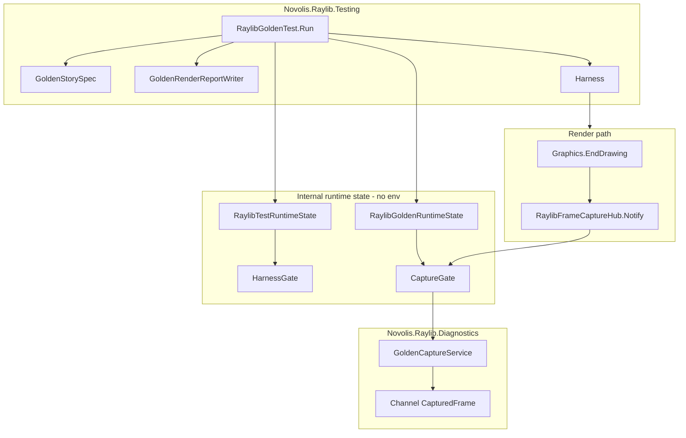

# Golden test framework for Novolis.Raylib

## Goals (v1)

- **Single-frame goldens** with **SHA256** in-code validation (pixel tolerance deferred).
- **No environment variables** for golden/capture/harness gating — use **internal scoped state** only.
- **Opt-in capture** with negligible cost when off (volatile gate + branch in hub).
- **Structured render output** under `temp/test-renders/adhoc-runs/...` (Star Conflicts Revolt–style layout).
- **QA review bundle** per story: PNG(s) plus **HTML report** with an **expectations column** (itemized, for human and agentic eyes) — emitted on **every** run (pass or fail), independent of automated hash assert.
- Works in **Release** CI (capture via `ScreenFramebufferCapture`, not `#if DEBUG` hooks).
- Build on: [`RaylibOffscreenTestHarness`](src/Novolis.Raylib.Testing/RaylibOffscreenTestHarness.cs), [`ScreenFramebufferCapture`](src/Novolis.Raylib.Runtime/Rendering/ScreenFramebufferCapture.cs), [`InjectEndDrawingNotifyHook`](codegen/Novolis.Raylib.CodeGen.Hooks/InjectEndDrawingNotifyHook.cs).

---

## Design principles

| Principle | Implementation |
|-----------|----------------|
| No env vars for golden framework | `RaylibTestRuntimeState`, `RaylibGoldenRuntimeState` — `internal`, static scoped stacks |
| Automated + visual QA | Every run writes `index.html` + PNGs; hash assert is additive |
| Expectations are first-class | `GoldenStorySpec.Expectations` — string bullets, rendered beside each image |
| Run output ≠ committed baselines | `temp/test-renders/...` (gitignored) vs `tests/.../Goldens/` (committed) |
| Zero cost when off | Hub `Notify()` checks `RaylibGoldenRuntimeState.IsCaptureActive` (single volatile) |

**Note on existing env vars:** `NOVOLIS_RAYLIB_*` remain elsewhere in the repo for now, but the **golden framework path does not read or set them**. Harness gating for goldens uses `RaylibTestRuntimeState` only. A follow-up can migrate shell/samples off env vars separately.

---

## Architecture



### Assembly layout

| Project | Packable | Role |
|---------|----------|------|
| [`Novolis.Raylib.Diagnostics`](src/Novolis.Raylib.Diagnostics/) | No | Capture service, channel, session — gated by `RaylibGoldenRuntimeState` |
| [`Novolis.Raylib.Runtime`](src/Novolis.Raylib.Runtime/) | Yes | `RaylibFrameCaptureHub`, `RaylibTestRuntimeState` (partial), `InternalsVisibleTo` |
| [`Novolis.Raylib.Testing`](src/Novolis.Raylib.Testing/) | Yes | Public `RaylibGoldenTest`, spec, report writer, layout resolver |
| [`tests/Novolis.Raylib.Golden`](tests/Novolis.Raylib.Golden/) | No | Stories + committed baselines + `[Category("Golden")]` |

---

## Layer 0: Internal runtime state (no env vars)

### `RaylibTestRuntimeState` (Runtime, `internal`)

Scoped stack (`AsyncLocal` or immutable struct push/pop) for test harness:

```csharp
internal static class RaylibTestRuntimeState
{
    public static bool NativeOffscreenEnabled { get; }
    public static RaylibTestScope EnterNativeOffscreen(); // IDisposable push
}
```

- **`EnterNativeOffscreen()`** sets: native offscreen allowed, optional hidden window defaults.
- Replaces env checks in golden path inside [`RaylibOffscreenTestHarness.IsNativeOffscreenRunRequested()`](src/Novolis.Raylib.Testing/RaylibOffscreenTestHarness.cs) when `RaylibTestRuntimeState.IsActive`.
- [`RaylibTestSession`](src/Novolis.Raylib.Testing/RaylibTestSession.cs) becomes a thin public wrapper: `EnterNativeOffscreen()` + optional `EnterGoldenCapture()` — **does not** call `Environment.SetEnvironmentVariable`.

### `RaylibGoldenRuntimeState` (Diagnostics or Runtime, `internal`)

```csharp
internal static class RaylibGoldenRuntimeState
{
    public static bool IsCaptureActive { get; }
    public static GoldenRunMode Mode { get; } // Assert | UpdateBaselines | ReportOnly
    public static GoldenRenderRunContext? CurrentRun { get; }
    public static GoldenGoldenScope Enter(GoldenRunOptions options);
}
```

| `GoldenRunMode` | Behavior |
|-----------------|----------|
| `Assert` | SHA256 compare + write review bundle |
| `UpdateBaselines` | Rewrite committed `Goldens/{story}/baseline.png` + `spec.json` hash |
| `ReportOnly` | Skip hash assert; still write review bundle (adhoc / exploratory) |

### CI without env vars

[`tests/Novolis.Raylib.Golden/AssemblySetup.cs`](tests/Novolis.Raylib.Golden/AssemblySetup.cs) (TUnit `[AssemblySetup]`):

```csharp
RaylibTestRuntimeState.EnableForAssembly(); // static flag for assembly lifetime
```

Golden tests call `RaylibGoldenTest.Run(...)` which enters scopes — no `NOVOLIS_RAYLIB_*` in CI yaml.

---

## Layer 1: Frame capture hub (Runtime)

Same as prior plan: [`RaylibFrameCaptureHub`](src/Novolis.Raylib.Runtime/Internal/RaylibFrameCaptureHub.cs) + codegen hook after `NotifyAfterEndDrawing()`.

Gate reads **`RaylibGoldenRuntimeState.IsCaptureActive`** only (not env, not `RaylibDebugCaptureGate` for golden path).

---

## Layer 2: Diagnostics (internal capture)

- **`GoldenCaptureService`** — periodic/frame capture to `Channel<CapturedFrame>` when `RaylibGoldenRuntimeState` active.
- **`GoldenCaptureSession`** — `IDisposable`; register hub handler on enter, drain on exit.
- v1 goldens still use explicit last-frame capture in harness; channel is for multi-frame / future video.

---

## Layer 3: Render output layout (Star Conflicts Revolt style)

### Path template

All adhoc run output goes under repo `temp/` (gitignored):

```
{repoRoot}/temp/test-renders/adhoc-runs/{runFolder}/assemblies/{assemblySegment}/renders/{storyId}/
```

| Segment | Example | Rule |
|---------|---------|------|
| `runFolder` | `20260517-101018_55300_977ed809c5f44ef0bc4643df4ef062b7` | `{yyyyMMdd-HHmmss}_{pid:D5}_{runGuid:N}` |
| `assemblySegment` | `Novolis_Raylib_Golden` | Test assembly name, sanitized (`/` → `_`, spaces removed) |
| `storyId` | `raylib-golden-smoke-scene` | Kebab-case story id from spec |

**Reference layout** (from Star Conflicts Revolt):

`D:\github\StarConflictsRevolt\temp\test-renders\adhoc-runs\20260517-101018_55300_977ed809...\assemblies\StarConflictsRevolt_Tests_Unit\renders\raylib-golden-story`

**Novolis equivalent:**

`{repo}/temp/test-renders/adhoc-runs/20260517-101018_55300_a1b2c3.../assemblies/Novolis_Raylib_Golden/renders/raylib-golden-smoke-scene/`

### Per-story folder contents (every run)

| File | Purpose |
|------|---------|
| `index.html` | **QA review page** (primary deliverable for eyes) |
| `manifest.json` | Machine-readable run metadata (paths, hashes, assert result) |
| `actual.png` | Frame captured this run |
| `baseline.png` | Copy of committed baseline (or placeholder if update mode) |
| `expectations.md` | Plain-text copy of bullets (for agents without HTML parser) |

Optional on failure: `assert.txt` (exception message + expected vs actual hash).

### `GoldenRenderOutputLayout` (Testing, internal + public resolver)

```csharp
public sealed class GoldenRenderRunContext
{
    public string RunFolder { get; }      // full adhoc-runs path
    public string StoryDirectory { get; } // .../renders/{storyId}
    public string AssemblySegment { get; }
}
```

- **`GoldenRenderOutputLayout.CreateRun(Assembly testAssembly, string storyId)`** — creates run folder once per test run (static run id shared across stories in same `RaylibGoldenTest` session optional).
- Root defaults to `{FindRepoRoot()}/temp/test-renders` via existing [`VisualCaptureArtifacts.FindRepoRoot`](src/Novolis.Raylib.Testing/VisualCaptureArtifacts.cs) pattern; overridable via `GoldenRunOptions.OutputRoot` for forks.

Update [`.gitignore`](.gitignore): `temp/test-renders/` (if not already covered by `temp/` or `artifacts/`).

---

## Layer 4: QA review report (expectations column)

### `GoldenStorySpec` (committed + runtime)

```json
{
  "schemaVersion": 1,
  "storyId": "raylib-golden-smoke-scene",
  "title": "2D smoke scene",
  "width": 320,
  "height": 240,
  "maxFrames": 4,
  "baselineSha256": "…",
  "expectations": [
    "Background fill is RayWhite (#F5F5F5).",
    "Outer border: 1px DarkGray rectangle inset 4px from edges.",
    "Two diagonal DarkGray lines corner-to-corner (X pattern).",
    "Left panel: blue filled rectangle 88×72 at (16, vertical center − 36).",
    "Right panel: green filled rectangle 88×72, mirrored on the right.",
    "Center: red filled circle radius 28 at screen center.",
    "Top bar: DarkGray strip with white text 'Novolis smoke' at (24, 22), 18px.",
    "Footer: 'pre-Game visual check' in DarkGray at y ≈ height − 36."
  ]
}
```

Stored at: `tests/Novolis.Raylib.Golden/Goldens/{storyId}/spec.json` + `baseline.png`.

**In test code** (optional duplicate for compile-time safety):

```csharp
RaylibGoldenTest.Run(GoldenStories.SmokeScene, renderer);
// or
RaylibGoldenTest.Run(new GoldenStorySpec { StoryId = "...", Expectations = [...] }, renderer);
```

Spec in repo is source of truth; test can reference shared `GoldenStories` static class generated from or mirroring JSON.

### `GoldenRenderReportWriter` — HTML layout

Two-column table, one row per **render slot** (v1: single `actual` frame; v2: multiple frames as extra rows):

```html
<table>
  <thead><tr><th>Render</th><th>Expected (QA checklist)</th></tr></thead>
  <tbody>
    <tr>
      <td>
        
        <p>Baseline: </p>
        <p>Status: PASS | SHA256: abc…</p>
      </td>
      <td>
        <ol>
          <li>Background fill is RayWhite…</li>
          …
        </ol>
      </td>
    </tr>
  </tbody>
</table>
```

- **Always generated** — pass, fail, or `ReportOnly`.
- **`expectations.md`** — same bullets as `<ol>` for CLI/agent tools (`cat expectations.md`).
- **`manifest.json`** — includes `expectations[]`, `assertPassed`, `actualSha256`, `baselineSha256`, relative paths.

This satisfies: *even when validation is in-code, humans/agents can open `index.html` and verify visually against itemized expectations.*

### Agentic review hook (v1 light, v2 full)

- v1: document path in test output / TUnit attachment: `Golden render report: file:///.../index.html`
- v2 (optional): `GoldenRenderReportWriter` also writes `agent-brief.json` with `{ storyId, imagePath, expectations[], assertPassed }` for MCP vision tools.

---

## Layer 5: `RaylibGoldenTest` API

```csharp
public static GoldenTestResult Run(
    string storyId,
    IRaylibFrameRenderer renderer,
    GoldenRunOptions? options = null);
```

**Flow:**

1. Load `GoldenStorySpec` from `Goldens/{storyId}/spec.json`.
2. `using var testScope = RaylibTestRuntimeState.EnterNativeOffscreen();`
3. `using var goldenScope = RaylibGoldenRuntimeState.Enter(options);` — sets mode, run context, output paths.
4. `GoldenRenderOutputLayout` creates `.../adhoc-runs/{run}/assemblies/{asm}/renders/{storyId}/`.
5. `RaylibOffscreenTestHarness.Run` with spec width/height/maxFrames.
6. Write `actual.png`; copy committed `baseline.png` into story folder.
7. **`GoldenRenderReportWriter.Write(spec, actualPng, assertResult)`** → `index.html`, `expectations.md`, `manifest.json`.
8. If mode `Assert` → `FramebufferAssert.AssertHash(actual, spec.BaselineSha256)`.
9. If mode `UpdateBaselines` → overwrite `tests/.../Goldens/{storyId}/baseline.png` + update `spec.json` hash.
10. Return `GoldenTestResult` with `ReviewReportPath`, `AssertPassed`, `StoryDirectory`.

### `GoldenRunOptions`

```csharp
public sealed class GoldenRunOptions
{
    public GoldenRunMode Mode { get; init; } = GoldenRunMode.Assert;
    public string? OutputRoot { get; init; }  // default: {repo}/temp/test-renders
    public bool EnableStreamingCapture { get; init; } // Channel, off by default
}
```

No env var equivalents.

### TUnit

- `[Category("Golden")]` + `[RunOnlyIfNativeRaylib]` implemented via `RaylibTestRuntimeState` / native DLL probe — **not** env.
- On skip: still write minimal report explaining skip reason to `temp/test-renders/.../skipped-{storyId}/index.html`.

---

## Layer 6: Codegen / manifest

- Extend [`InjectEndDrawingNotifyHook`](codegen/Novolis.Raylib.CodeGen.Hooks/InjectEndDrawingNotifyHook.cs) only — `RaylibFrameCaptureHub.Notify()`.
- **Do not** emit env var constants for golden capture in [`raylib-debug.manifest.json`](pipeline/raylib6/raylib-debug.manifest.json).
- Optional manifest field `frameHubNotifyAfter`: `"EndDrawing"` for documentation/codegen only.

---

## Layer 7: Test project and CI

### `tests/Novolis.Raylib.Golden`

- `Goldens/raylib-golden-smoke-scene/spec.json` + `baseline.png`
- Additional stories: HUD, minimal 3D cube
- `AssemblySetup` enables `RaylibTestRuntimeState` for assembly — **no env in workflow**

### CI job `golden-tests` (windows-latest)

```yaml
steps:
  - dotnet run pipeline/raylib6/fetch-sources.cs
  - dotnet run pipeline/raylib6/run.cs native
  - dotnet test --filter "Category=Golden"
  # Upload temp/test-renders as CI artifact for failed jobs (optional)
```

### Maintainer: update baselines

```csharp
RaylibGoldenTest.Run("raylib-golden-smoke-scene", renderer,
    new GoldenRunOptions { Mode = GoldenRunMode.UpdateBaselines });
```

Or dedicated test marked `[Explicit]` — still no env vars.

After update: commit `tests/.../Goldens/**` and re-run in `Assert` mode; open `temp/.../index.html` to visually confirm expectations still match.

---

## Determinism (unchanged)

- Fixed resolution, `MaxFrames`, no time-based animation in v1 stories.
- `RaylibGlfwTestSync` for GLFW serialization.
- Document canonical baseline machine: Windows CI image.
- Expectations text should describe **stable** visual features (colors, regions, text), not frame timing.

---

## Deferred

| Item | Notes |
|------|-------|
| Per-pixel tolerance / diff column in HTML | v2 |
| Video / frame sequences | v2; channel groundwork remains |
| Migrate all `NOVOLIS_RAYLIB_*` repo-wide | Out of golden v1 scope; golden path is env-free |
| `agent-brief.json` for vision MCP | v2 |
| `SimulatedInput` wiring | Separate |

---

## Implementation order

1. **`RaylibTestRuntimeState` + `RaylibGoldenRuntimeState`** — refactor harness/session; remove env usage on golden path
2. **`RaylibFrameCaptureHub`** + codegen hook
3. **`Novolis.Raylib.Diagnostics`** — capture service (state-gated)
4. **`GoldenRenderOutputLayout` + `GoldenRenderReportWriter`** — path template + HTML/MD/manifest
5. **`GoldenStorySpec` + `RaylibGoldenTest`** — assert/update/report modes; always emit review bundle
6. **`tests/Novolis.Raylib.Golden`** + CI job (no env) + `.gitignore` for `temp/test-renders`
7. Docs: [`docs/testing.md`](docs/testing.md) — how QA opens `index.html`, how to update baselines, path layout
