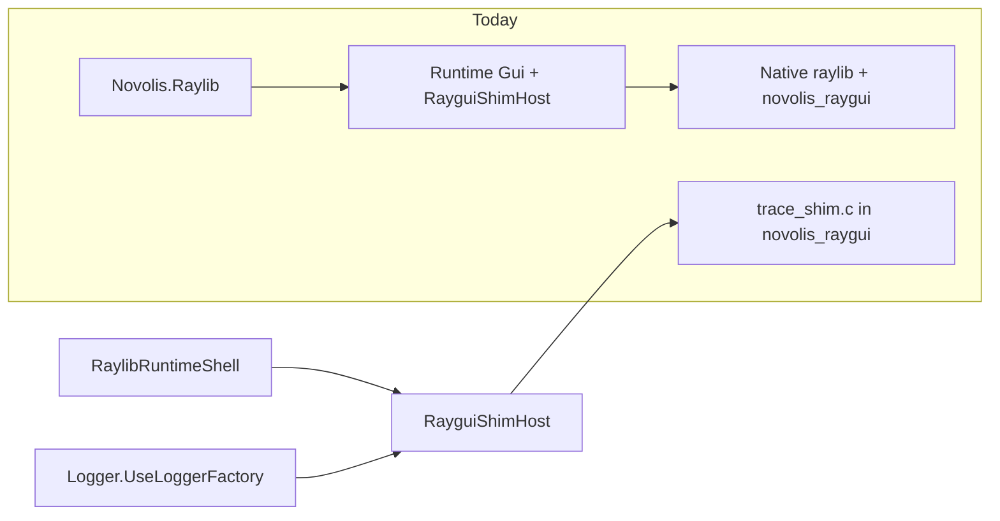
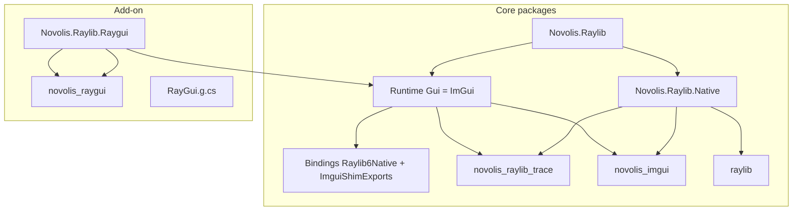

# ImGui as default UI; RayGui as add-on

## Goals (from your choices)

| Decision | Choice |
|----------|--------|
| Native stack | **cimgui** + **raylib-cimgui** (pure C; stable exports for codegen) |
| Public API | Keep **`Gui`** in core; **reimplement with ImGui** (Dear ImGui idioms, not rectangle-raygui widgets) |
| RayGui | **`Novolis.Raylib.Raygui`** add-on with `RayGui` façade + `novolis_raygui` native |

**Breaking change:** Current `Gui.Button(RectangleF, …)` and similar raygui signatures move to the add-on as `RayGui.*`. Core `Gui` becomes ImGui-style (`NewFrame`, `BeginWindow`, `Button(string)`, etc.).

---

## Current state (why this is non-trivial)



- RayGui interop: [`pipeline/raylib6/raygui-exports.manifest.json`](pipeline/raylib6/raygui-exports.manifest.json) → [`RayguiShimExports.g.cs`](src/Novolis.Raylib.Bindings/Interop/RayguiShimExports.g.cs) via [`RayguiInteropEmitter.cs`](codegen/Novolis.Raylib.CodeGen/Emit/RayguiInteropEmitter.cs).
- Façade: [`pipeline/raylib6/gui.manifest.json`](pipeline/raylib6/gui.manifest.json) → [`Gui.g.cs`](src/Novolis.Raylib.Runtime/Gui/Gui.g.cs) → hand-written [`GuiControls.cs`](src/Novolis.Raylib.Runtime/Gui/GuiControls.cs).
- **Trace logging** lives in [`trace_shim.c`](native/raylib6-with-raygui/trace_shim.c) inside `novolis_raygui` — core paths load the GUI DLL even when no widgets are used ([`RaylibRuntimeShell.cs:56`](src/Novolis.Raylib.Runtime/Shell/RaylibRuntimeShell.cs), [`Logger.cs:38`](src/Novolis.Raylib.Runtime/Logging/Logger.cs)).

---

## Target architecture



---

## Phase 1 — Decouple trace from raygui (unblocks optional RayGui)

**Native**

- New CMake target: `native/raylib6-platform/` (or rename existing folder) building **`novolis_raylib_trace`** with only [`trace_shim.c`](native/raylib6-with-raygui/trace_shim.c).
- Remove `trace_shim.c` from [`native/raylib6-with-raygui/CMakeLists.txt`](native/raylib6-with-raygui/CMakeLists.txt) so `novolis_raygui` is GUI-only.

**Managed**

- Point [`NovolisRaylibTraceForwarderNative.cs`](src/Novolis.Raylib.Runtime/Interop/NovolisRaylibTraceForwarderNative.cs) at `novolis_raylib_trace` (new `LibraryImport` DLL name).
- Add `RaylibTraceHost` (minimal load/bind, mirror [`RayguiShimHost.cs`](src/Novolis.Raylib.Runtime/RayguiShimHost.cs) pattern).
- Update [`Logger.cs`](src/Novolis.Raylib.Runtime/Logging/Logger.cs) to use `RaylibTraceHost`, not `RayguiShimHost`.
- Remove eager `RayguiShimHost.EnsureInitialized()` from [`RaylibRuntimeShell`](src/Novolis.Raylib.Runtime/Shell/RaylibRuntimeShell.cs), [`RaylibDebug`](src/Novolis.Raylib.Runtime/Debug/RaylibDebug.cs), and [`RaylibOffscreenTestHarness`](src/Novolis.Raylib.Testing/RaylibOffscreenTestHarness.cs) (golden path should not require raygui).

**Packaging**

- [`Novolis.Raylib.Native.csproj`](src/Novolis.Raylib.Native.csproj) + [`build/Novolis.Raylib.Native.targets`](build/Novolis.Raylib.Native.targets): ship `novolis_raylib_trace` on all RIDs alongside `raylib`.

---

## Phase 2 — Native ImGui module (cimgui + raylib-cimgui)

**Vendor / fetch** ([`pipeline/raylib6/versions.json`](pipeline/raylib6/versions.json), [`fetch-sources.cs`](pipeline/raylib6/fetch-sources.cs))

- Pin **Dear ImGui**, **cimgui**, and **raylib-cimgui** tags/commits under `vendor/imgui-*` (same discipline as `vendor/raygui-6/raygui.h`).
- Extend `run.cs native` to build **`native/raylib6-with-imgui/`** → `novolis_imgui.dll` / `.so` / `.dylib`.

**CMake shim** (new `native/raylib6-with-imgui/`)

- Compile cimgui + raylib-cimgui sources against raylib 6 headers (same link pattern as [`native/raylib6-with-raygui/CMakeLists.txt`](native/raylib6-with-raygui/CMakeLists.txt): Windows `.def` import lib, Linux `libraylib.so`).
- Export a **curated stable C surface** for codegen (not full 500+ `ig*` symbols on day one), e.g.:
  - Setup/shutdown: `novolis_rlimgui_setup`, `novolis_rlimgui_shutdown`
  - Frame: `novolis_rlimgui_begin`, `novolis_rlimgui_end` (wrap raylib-cimgui begin/end + render)
  - Input bridge helpers if needed (keyboard/mouse from raylib)
  - Widget subset mapped to manifest rows: `igBegin`, `igEnd`, `igButton`, `igText`, `igCheckbox`, `igSliderFloat`, `igInputText`, etc.

Prefer **wrapping** raylib-cimgui entry points with `NOVOLIS_IMGUI_API` exports so manifest rows stay stable if upstream renames internals.

**Packaging**

- Core [`Novolis.Raylib.Native`](src/Novolis.Raylib.Native.csproj) ships `novolis_imgui` instead of `novolis_raygui`.
- RayGui add-on gets its own native package (Phase 4).

---

## Phase 3 — Codegen + core `Gui` (ImGui)

**Pipeline / codegen** ([`RaylibCodegenPipeline.cs`](codegen/Novolis.Raylib.CodeGen/RaylibCodegenPipeline.cs))

| Addition | Purpose |
|----------|---------|
| `RaylibCodegenPhase.ImGui` | Hook isolation for ImGui interop transforms |
| `imgui-exports.manifest.json` | Curated exports + template IDs |
| `ImguiInteropEmitter.cs` | Clone [`RayguiInteropEmitter.cs`](codegen/Novolis.Raylib.CodeGen/Emit/RayguiInteropEmitter.cs) → `ImguiShimExports.g.cs` |
| `EmitImguiInterop()` in `GenerateAll()` | After raylib interop, before facades |
| MSBuild outputs | Add `ImguiShimExports.g.cs` to [`build/Novolis.Raylib.CodeGen.targets`](build/Novolis.Raylib.CodeGen.targets) |

**Hand-written runtime** (`src/Novolis.Raylib.Runtime/`)

- `ImguiShimHost.cs` — load `novolis_imgui`, bind exports (same lazy-init pattern as raygui).
- `GuiControls.cs` — **rewrite** for ImGui: UTF-8 marshalling, `ImGuiIO`/`ImGuiStyle` only if exposed in v1; frame lifecycle helpers.

**Façade manifest** — replace [`gui.manifest.json`](pipeline/raylib6/gui.manifest.json) with ImGui-oriented methods, e.g.:

```json
{ "name": "NewFrame", "signature": "void NewFrame()", "body": "GuiControls.NewFrame()" }
{ "name": "BeginWindow", "signature": "bool BeginWindow(string title)", "body": "GuiControls.BeginWindow(title)" }
{ "name": "Button", "signature": "bool Button(string label)", "body": "GuiControls.Button(label)" }
```

Regenerate [`Gui.g.cs`](src/Novolis.Raylib.Runtime/Gui/Gui.g.cs); update type summary to “Dear ImGui via cimgui; call after scene/HUD, before `EndDrawing`.”

**Frame integration**

- Document explicit frame contract in `Gui` XML: `Graphics.BeginDrawing()` → scene/HUD → `Gui.NewFrame()` → widgets → `Gui.Render()` → `Graphics.EndDrawing()`.
- Optional v1.1: codegen hook (similar to [`InjectEndDrawingNotifyHook`](codegen/Novolis.Raylib.CodeGen.Hooks/InjectEndDrawingNotifyHook.cs)) or shell helper to call `Gui.NewFrame`/`Gui.Render` when `ImguiShimHost` is enabled — defer auto-magic until manual path is proven in samples/tests.

**Codegen discipline**

- Gate **raygui** emit behind MSBuild property `IncludeRaygui=true` (default `false` for core Bindings build).
- Core `generate` produces: raylib interop + **imgui** interop + facades/Hud/**Gui**; no `RayguiShimExports.g.cs` in core Bindings.

---

## Phase 4 — RayGui add-on package

**New projects**

| Package | Contents |
|---------|----------|
| `Novolis.Raylib.Raygui` | `RayGui` façade, `RayGuiControls`, `RayguiShimHost`; references `Novolis.Raylib.Runtime` |
| `Novolis.Raylib.Raygui.Native` | Packs only `novolis_raygui` per RID |

**Manifests**

- Move [`raygui-exports.manifest.json`](pipeline/raylib6/raygui-exports.manifest.json) emit output to Raygui.Bindings (or Raygui project with linked generated file).
- New [`raygui.manifest.json`](pipeline/raylib6/raygui.manifest.json) (rename from current gui content): type `RayGui`, methods = today’s rectangle widgets (`RayGuiControls.*`).

**Meta package**

- [`Novolis.Raylib.csproj`](src/Novolis.Raylib/Novolis.Raylib.csproj): update description to “raylib + ImGui”; **do not** reference Raygui by default.
- Optional convenience metapackage `Novolis.Raylib.All` referencing Raygui — only if you want one-line install for both UIs.

**Move files out of core Runtime**

- `RayguiShimHost`, `GuiControls` (→ `RayGuiControls`), generated raygui interop bindings.

---

## Phase 5 — CI, tests, samples, docs

**Pipeline** ([`pipeline/raylib6/run.cs`](pipeline/raylib6/run.cs), [`.github/workflows/ci.yml`](.github/workflows/ci.yml))

- `fetch` pulls imgui/cimgui/raylib-cimgui sources.
- Windows `native` builds `novolis_imgui` + `novolis_raylib_trace`; Raygui native build runs in Raygui package CI or optional job.
- Core build/test no longer requires `novolis_raygui`.

**Tests**

- [`tests/Novolis.Raylib.CodeGen.Unit`](tests/Novolis.Raylib.CodeGen.Unit): ImGui manifest ↔ emitter tests; move raygui tests to Raygui test project.
- Golden/offscreen: ensure harness does not load raygui shim; add optional `[Category("ImGui")]` smoke once deterministic (may need `ImGuiConfigFlags` / fixed delta time).

**Samples**

- New `samples/HelloGui` — minimal `Gui.NewFrame` / `BeginWindow` / `Button` loop via `RayGame.Run`.
- Optional `samples/HelloRaygui` in Raygui package showing `RayGui.Panel(...)`.

**Docs / agent registry**

- [AGENTS.md](AGENTS.md), [docs/codegen.md](docs/codegen.md), [docs/testing.md](docs/testing.md), [agentic-tools/registry.json](agentic-tools/registry.json): manifest table adds `imgui-exports.manifest.json`; Raygui documented as add-on workflow.

---

## Suggested implementation order

1. **Trace DLL split** — smallest risk; fixes “GUI DLL required for logging” immediately.
2. **Native `novolis_imgui` + fetch** — prove Windows build in CI first (matches current golden/native jobs).
3. **ImGui codegen + `GuiControls` rewrite + new `gui.manifest.json`** — core API swap.
4. **Raygui add-on extraction** — move manifests, emitters, hosts, native pack.
5. **Shell/samples/tests/docs** — polish and migration notes.

---

## Risks and mitigations

| Risk | Mitigation |
|------|------------|
| Linux/macOS ImGui + OpenGL via raylib | Start Windows CI green; add linux-x64 native job after first green build; document RID gaps in Native README |
| Huge cimgui API | Curated manifest v1 (~30–50 symbols); grow via `imgui-exports.manifest.json` rows + templates |
| Non-deterministic golden pixels with ImGui | Keep ImGui out of default golden scenes; dedicated gated tests with fixed IO/time |
| Breaking `Gui` API | Clear migration: `Gui.*` → ImGui idioms; `RayGui.*` add-on for old widgets |

---

## Out of scope (later)

- Full auto-generated binding of all `ig*` symbols (use `suggest-raylib`-style tool later if needed).
- Docking/viewports/multi-viewport (enable in vendor pins once base path works).
- Replacing [`Hud`](src/Novolis.Raylib.Runtime/Hud/Hud.g.cs) with ImGui (Hud stays raylib 2D composition).
