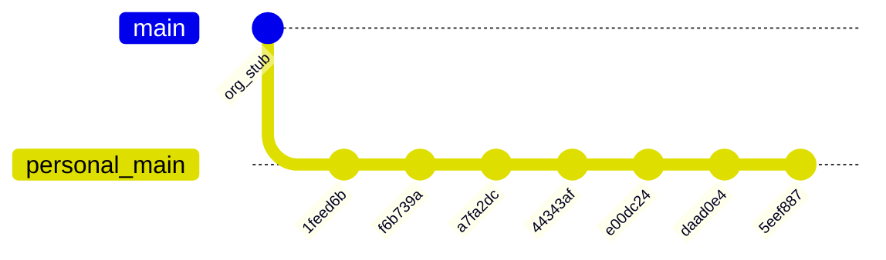

# Migrate novolis-raylib history to Novolis-Platform

## Current state



| Location | `main` tip | Notes |
|----------|------------|--------|
| Local [`d:\novolis\novolis-raylib`](d:\novolis\novolis-raylib) | `5eef887` | Clean tree; 7 implementation commits |
| `origin` → `frankhaugen/novolis-raylib` | `5eef887` | Wrong remote (mirror of local) |
| [`Novolis-Platform/novolis-raylib`](https://github.com/Novolis-Platform/novolis-raylib) | `3e68ba07` | **Keep this** — `Bootstrap Novolis organization infrastructure` (~27 skeleton files: governance, issue templates, placeholder docs, stub workflows) |

**Target history** (new SHAs OK; messages and content preserved):

```text
3e68ba07  Bootstrap Novolis organization infrastructure   ← org root (unchanged)
    →     Initial Novolis.Raylib stack…
    →     CI: trigger only on main branch.
    →     … (5 more existing messages)
    →     Enhance documentation and CI workflows…
```

**Method:** `git rebase --onto novolis/main --root main` — replays commits oldest→newest on top of org stub. No unrelated-history merge, no force-push of alien root.

---

## Phase 1 — Safety backup

```powershell
cd d:\novolis\novolis-raylib
git branch backup-pre-org-migrate
git bundle create ..\novolis-raylib-backup.bundle --all
```

---

## Phase 2 — Add org remote and rebase

```powershell
git remote add novolis https://github.com/Novolis-Platform/novolis-raylib.git
git fetch novolis
git log --oneline -1 novolis/main   # expect: Bootstrap Novolis organization infrastructure
git checkout main
git rebase --onto novolis/main --root main
```

**Expected conflicts** on early replays (org skeleton vs first implementation commit overlap):

| Path | Resolution |
|------|----------------|
| [`README.md`](README.md) | Keep **implementation** README (Novolis.Raylib install/quick start) |
| [`.github/workflows/ci.yml`](.github/workflows/ci.yml), [`release.yml`](.github/workflows/release.yml) | Keep **local** versions (full pipeline + NuGet OIDC; org stub is placeholder) |
| [`Directory.Build.props`](Directory.Build.props), [`Directory.Packages.props`](Directory.Packages.props) | Keep **local** (real solution); merge org-only keys if any are missing |
| [`docs/getting-started.md`](docs/getting-started.md) | Keep **local** if present; otherwise retain org stub until a later commit adds content |
| [`.novolis/packages.json`](.novolis/packages.json) | Keep **org** file if local tree has no `.novolis/` |
| `CODE_OF_CONDUCT.md`, `CONTRIBUTING.md`, `SECURITY.md`, issue templates | Keep **org** versions unless local explicitly replaced them |

After each conflict: `git add .` → `git rebase --continue`. To abort entire operation: `git rebase --abort` (then restore from `backup-pre-org-migrate`).

---

## Phase 3 — Push to org and repoint `origin`

```powershell
# Should fast-forward org main from 3e68ba07 → new tip (no rewrite of org root)
git push novolis main:main

git remote set-url origin https://github.com/Novolis-Platform/novolis-raylib.git
git fetch origin
git branch -u origin/main main
git remote rename novolis novolis-temp   # optional cleanup, or: git remote remove novolis
git remote add fork https://github.com/frankhaugen/novolis-raylib.git   # optional archive pointer
```

**Verification:**

```powershell
git log --oneline origin/main          # 8 commits: org stub + 7 replayed
git diff backup-pre-org-migrate main     # expect empty (same tree, different base/history)
```

On GitHub:

- [`Novolis-Platform/novolis-raylib`](https://github.com/Novolis-Platform/novolis-raylib) shows full codebase on `main`
- Actions: CI workflow runs green on org repo
- NuGet trusted publish still matches [`release.yml`](.github/workflows/release.yml) on org `main`

If `git push novolis main:main` is rejected (branch protection): temporarily allow admin bypass or push via PR from `migrate-main` branch; do **not** use unrelated-history merge.

---

## Phase 4 — Retire mistaken personal repo

After org `main` is verified (files, CI, log order):

1. Archive **`frankhaugen/novolis-raylib`** on GitHub (Settings → Archive), or delete if policy allows
2. Update Rider metadata: [`.idea/.idea.Novolis.Raylib/.idea/workspace.xml`](.idea/.idea.Novolis.Raylib/.idea/workspace.xml) still points at `frankhaugen` URL — re-sync VCS root to org remote in IDE

---

## Phase 5 — Prevent recurrence (small doc guard)

Add to [`AGENTS.md`](AGENTS.md) (or [`.cursor/rules/`](.cursor/rules/)):

- Repos under `d:\novolis\*` must use `origin` = `https://github.com/Novolis-Platform/<repo>.git`
- Before first `git push` / `gh repo create`: run `git remote -v` and require `Novolis-Platform`
- Never `gh repo create` without `--org Novolis-Platform` for reserved `novolis-*` names

---

## Rollback

If anything goes wrong before push:

```powershell
git checkout main
git reset --hard backup-pre-org-migrate
```

If push to org was wrong: org admin can reset `main` to `3e68ba07` via GitHub UI; local backup branch/bundle still has full pre-migrate state.
