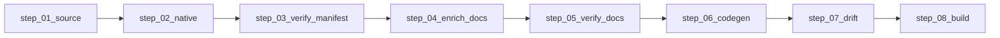
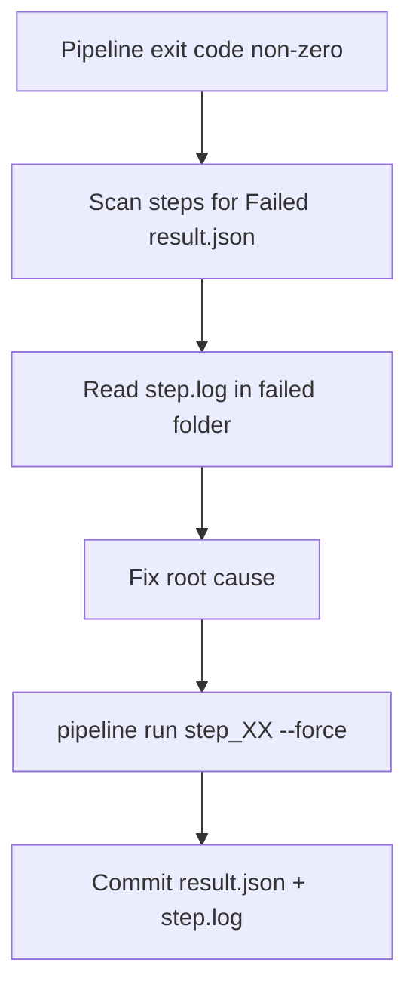

# Linear pipeline with checked-in step results

## Goal

Replace the fragmented maintainer flow (`run.cs`, `fetch-sources.cs`, PS1 wrappers) with a **single C# pipeline** whose progress is **visible in git**: fixed step folders, a **`result.json`** (outcome + file fingerprints), and **`step.log`** (full console capture) per step. Downloads and builds write into each step’s `artifacts/` only when required files are missing or inputs changed.

**Default artifact policy** (you skipped the clarifying question; this is the recommended balance):

| Committed | Gitignored |
|-----------|------------|
| `steps/step_XX_*/README.md`, `result.json`, `step.log` | `steps/step_XX_*/artifacts/**` (DLLs, `.so`, git clones, zips) |
| Step folder skeleton always present | Existing global `*.dll` rules remain |

Headers used by `verify` can live under `artifacts/` locally; CI always runs `step_01` fetch on Linux/Windows as today.

---

## Target layout

```text
pipeline/raylib6/
  versions.json                    # unchanged (download URLs/refs)
  *.manifest.json                  # unchanged (source of truth for codegen)
  steps/
    step_01_source/
      README.md
      result.json
      step.log
      artifacts/
        raylib-6/                  # was vendor/raylib-6
        raygui-6/
        raylib-cimgui/
    step_02_native/
      README.md
      result.json
      step.log
      artifacts/
        novolis_raylib_trace.dll   # copies or refs from native/*/out
        novolis_imgui.dll
        novolis_raygui.dll
    step_03_verify_manifest/
    step_04_enrich_docs/
    step_05_verify_docs/
    step_06_codegen/
    step_07_drift/
    step_08_build/                 # optional profile only
```

**Product C#** (`src/**/Interop/*.g.cs`, `Runtime/**/*.g.cs`) stays where it is; `step_06_codegen/result.json` lists emitted paths + manifest SHA256s (no duplicate copies in the step folder).



---

## New projects and abstractions

### 1. [`codegen/Novolis.Raylib.Pipeline/`](codegen/Novolis.Raylib.Pipeline/) (new exe)

- References [`Novolis.Raylib.CodeGen`](codegen/Novolis.Raylib.CodeGen/Novolis.Raylib.CodeGen.csproj) (emitters stay there).
- CLI (replace [`Program.cs`](codegen/Novolis.Raylib.CodeGen/Program.cs) orchestration over time):

```bash
dotnet run --project codegen/Novolis.Raylib.Pipeline -- run all
dotnet run --project codegen/Novolis.Raylib.Pipeline -- run agent-verify
dotnet run --project codegen/Novolis.Raylib.Pipeline -- run step_06_codegen
dotnet run --project codegen/Novolis.Raylib.Pipeline -- list
dotnet run --project codegen/Novolis.Raylib.Pipeline -- explain step_01_source
```

### 2. [`codegen/Novolis.Raylib.CodeGen.Abstractions/`](codegen/Novolis.Raylib.CodeGen.Abstractions/) — extend

Add pipeline contracts (keep `IRaylibCodegenHook` as-is):

```csharp
public interface IPipelineStep
{
    string Id { get; }           // "step_01_source"
    string Description { get; }
    IReadOnlyList<string> DependsOn { get; }
    ValueTask<StepResult> ExecuteAsync(PipelineContext ctx, CancellationToken ct);
}

public sealed class PipelineContext
{
    public string RepoRoot { get; }
    public string StepsRoot { get; }   // pipeline/raylib6/steps
    public PipelinePaths Paths { get; } // resolved artifact roots
    public TextWriter Log { get; }     // tees to step.log
    public bool Force { get; }
}
```

### 3. `PipelineRunner`

- Runs steps in dependency order.
- For each step:
  1. Open `steps/{id}/step.log` (truncate each run; write banner with UTC timestamp, command line, git sha optional).
  2. If `!Force` and [`StepSkipEvaluator`](codegen/Novolis.Raylib.Pipeline/StepSkipEvaluator.cs) says inputs unchanged + all declared outputs exist → status `Skipped`, update `result.json`, return.
  3. Else execute step; on completion write [`result.json`](pipeline/raylib6/steps/step_01_source/result.json) and flush log.
  4. On failure: non-zero exit; **do not run downstream** steps.

### 4. `result.json` schema (committed)

```json
{
  "stepId": "step_01_source",
  "status": "Succeeded",
  "startedUtc": "2026-05-18T12:00:00Z",
  "durationMs": 4200,
  "pipelineVersion": "1",
  "inputs": {
    "versions.json": "a1b2c3..."
  },
  "outputs": [
    {
      "path": "artifacts/raylib-6/include/raylib.h",
      "sha256": "...",
      "bytes": 123456
    }
  ],
  "error": null
}
```

- `Failed` steps set `"error": { "message": "...", "type": "..." }`.
- `Skipped` records `"skipReason": "outputs up to date"`.
- Each step’s `README.md` documents required outputs (human + agent readable).

### 5. Skip logic

`StepSkipEvaluator` compares:

- Hash of declared **input files** (e.g. `versions.json`, manifest files, previous step `result.json` output hashes).
- Existence + SHA256 of every path listed in the **last committed/successful** `result.json` under `artifacts/` or repo paths (for codegen: emitted `src` files).

`--force` bypasses skip (maintainer refresh).

---

## Step implementations

| Step | Port from | Writes artifacts | Writes repo product |
|------|-----------|------------------|---------------------|
| **step_01_source** | [`fetch-sources.cs`](pipeline/raylib6/fetch-sources.cs) | `artifacts/raylib-6`, `raygui-6`, `raylib-cimgui` | — |
| **step_02_native** | [`run.cs` `RunNative`](pipeline/raylib6/run.cs) | Copy/link shim DLLs into `artifacts/`; log cmake stdout to `step.log` | — |
| **step_03_verify_manifest** | [`RaylibManifestVerifier`](codegen/Novolis.Raylib.CodeGen/Verify/RaylibManifestVerifier.cs) | — | — |
| **step_04_enrich_docs** | [`FacadeDocEnricher`](codegen/Novolis.Raylib.CodeGen/Docs/FacadeDocEnricher.cs) `--write` | Updates `pipeline/raylib6/*.manifest.json` | manifest JSON |
| **step_05_verify_docs** | [`FacadeDocVerifier`](codegen/Novolis.Raylib.CodeGen/Docs/FacadeDocVerifier.cs) | — | — |
| **step_06_codegen** | Refactor [`RaylibCodegenPipeline`](codegen/Novolis.Raylib.CodeGen/RaylibCodegenPipeline.cs) into sub-calls (interop → imgui → raygui → debug → facades/hud/gui) | — | `src/**.g.cs` |
| **step_07_drift** | [`raylib-codegen-check.ps1`](scripts/raylib-codegen-check.ps1) | — | `git diff` on `pipeline/raylib6/`, `Bindings/`, `Runtime/`, **`Raygui/`** (fix current CI/local gap) |
| **step_08_build** | [`agent-verify.ps1`](scripts/agent-verify.ps1) build section | — | — |

**Fix while porting:** [`RaylibManifestSuggester`](codegen/Novolis.Raylib.CodeGen/Verify/RaylibManifestSuggester.cs) path `tools/vendor/...` → `PipelinePaths.RaylibIncludeDir`.

---

## Path centralization (critical migration)

Extend [`RepoPaths.cs`](codegen/Novolis.Raylib.CodeGen/RepoPaths.cs) → new `PipelinePaths`:

```csharp
public static string StepsRoot => Path.Combine(repoRoot, "pipeline", "raylib6", "steps");
public static string SourceArtifacts => Path.Combine(StepsRoot, "step_01_source", "artifacts");
public static string RaylibRoot => Path.Combine(SourceArtifacts, "raylib-6");
public static string RaylibInclude => Path.Combine(RaylibRoot, "include");
public static string RaylibPrebuiltWin => Path.Combine(RaylibRoot, "prebuilt", "win-x64");
// ... raygui, cimgui, native shim paths from step_02_native/artifacts
```

Update consumers (single sweep):

- CMake: [`native/raylib6-platform/CMakeLists.txt`](native/raylib6-platform/CMakeLists.txt), [`native/raylib6-with-imgui/CMakeLists.txt`](native/raylib6-with-imgui/CMakeLists.txt), [`native/raylib6-with-raygui/CMakeLists.txt`](native/raylib6-with-raygui/CMakeLists.txt) — `RAYLIB_NATIVE_DIR` / headers point at `step_01_source/artifacts/...`.
- [`Novolis.Raylib.Native.csproj`](src/Novolis.Raylib.Native/Novolis.Raylib.Native.csproj) + [`Novolis.Raylib.Bindings.csproj`](src/Novolis.Raylib.Bindings/Novolis.Raylib.Bindings.csproj) — pack/copy paths.
- [`RaylibHeaderDocs`](codegen/Novolis.Raylib.CodeGen/Docs/RaylibHeaderDocs.cs), manifest `header` fields in JSON (optional: keep `vendor/...` strings as docs-only aliases).
- [`.github/workflows/ci.yml`](.github/workflows/ci.yml) + [`release.yml`](.github/workflows/release.yml) — call `Pipeline run all` or `run step_01_source` + `step_02_native` instead of file scripts.

**Deprecate `vendor/`** as the write target; optional **one-release shim**: `step_01` also mirrors headers into `vendor/raylib-6/include` for external docs links, or update doc links to `pipeline/.../artifacts` (prefer updating references).

---

## Refactor codegen (step_06 internals)

Split `RaylibCodegenPipeline.GenerateAll()` into named internal operations invoked by `CodegenStep` (single step folder, one `step.log`), each logging sub-phase:

1. `verify-manifest`
2. `emit-interop` / `emit-imgui` / `emit-raygui` / `emit-debug`
3. `emit-facades` (+ hud/gui/raygui)
4. Hooks via existing [`WriteUnit`](codegen/Novolis.Raylib.CodeGen/RaylibCodegenPipeline.cs)

[`Program.cs`](codegen/Novolis.Raylib.CodeGen/Program.cs) thin commands delegate to `Pipeline` profiles for backward compat:

- `generate` → `pipeline run step_06_codegen` (or profile `generate` = steps 03–06).

---

## Git and `.gitignore`

Add to [`.gitignore`](.gitignore):

```gitignore
pipeline/raylib6/steps/*/artifacts/
```

Ensure **not** ignored:

```gitignore
!pipeline/raylib6/steps/**/result.json
!pipeline/raylib6/steps/**/step.log
!pipeline/raylib6/steps/**/README.md
```

Seed each step folder with baseline `result.json` (`status: "Pending"` or last green maintainer run) and empty `step.log` header in the initial PR.

---

## Scripts, registry, MSBuild (thin wrappers)

| Old | New |
|-----|-----|
| `dotnet run pipeline/raylib6/run.cs all` | `dotnet run --project codegen/Novolis.Raylib.Pipeline -- run maintainer` |
| `fetch-sources.cs` | `run step_01_source` (delete script after port) |
| `raylib-codegen-check.ps1` | `run ci-codegen` (steps 04–07) |
| `agent-verify.ps1` | `run agent-verify` (ci-codegen + step_08_build) |
| [`agentic-tools/registry.json`](agentic-tools/registry.json) | Point tool ids at Pipeline CLI |
| [`Novolis.Raylib.CodeGen.targets`](build/Novolis.Raylib.CodeGen.targets) | `dotnet run ... Pipeline -- run step_06_codegen` (or keep direct generate alias) |

**Delete** after port (same PR or follow-up): [`generate-raylib-interop.cs`](pipeline/raylib6/generate-raylib-interop.cs), [`generate-raygui-interop.cs`](pipeline/raylib6/generate-raygui-interop.cs), [`generate-raylib-debug-hooks.cs`](pipeline/raylib6/generate-raylib-debug-hooks.cs), [`verify-raylib-manifest-against-vendor.cs`](pipeline/raylib6/verify-raylib-manifest-against-vendor.cs) — superseded by Pipeline steps.

Keep [`run.cs`](pipeline/raylib6/run.cs) one release as:

```csharp
// Obsolete: forwards to Novolis.Raylib.Pipeline
```

---

## Solution and tests

- Add `Novolis.Raylib.Pipeline` to [`Novolis.Raylib.slnx`](Novolis.Raylib.slnx) under `/codegen/`.
- New tests in [`tests/Novolis.Raylib.CodeGen.Unit`](tests/Novolis.Raylib.CodeGen.Unit/) (or `Novolis.Raylib.Pipeline.Unit`):
  - `StepSkipEvaluator` — skip when hashes match; re-run when `versions.json` changes.
  - `result.json` serialization round-trip.
  - `step_03` fails when manifest symbol missing (temp header fixture).

---

## Docs / agent updates

- [`docs/codegen.md`](docs/codegen.md), [`AGENTS.md`](AGENTS.md), [`agentic-tools/workflows/codegen.md`](agentic-tools/workflows/codegen.md), [`pipeline/raylib6/BUILDING.txt`](pipeline/raylib6/BUILDING.txt) — document step folders, “open `step_XX/step.log` on failure”, commit `result.json` + `step.log` after maintainer runs.
- Per-step `README.md`: inputs, outputs, how to force-refresh.

---

## Rollout phases (single epic, merge in order)

1. **Scaffold** — step folders + `PipelinePaths` + gitignore + seed `result.json`/`README`/`step.log`.
2. **Pipeline host** — `PipelineRunner`, logging, `result.json` writer, `step_01` + `step_03`–`step_07`.
3. **Path migration** — point CMake, Native, Bindings, CodeGen at `step_01`/`step_02` artifacts; CI uses Pipeline.
4. **step_02_native** + delete legacy emit/verify scripts; obsolete `run.cs`/`fetch-sources.cs`.
5. **Registry/docs/tests** + `agent-verify` parity.

---

## Error-finding workflow (what you wanted)

When CI or local run fails:

1. Open `pipeline/raylib6/steps/` — find first `result.json` with `"status": "Failed"`.
2. Read that folder’s **`step.log`** (full detail).
3. Inspect `artifacts/` locally if the step downloaded/built.
4. Fix manifests/codegen/native; re-run from failed step: `pipeline run step_06_codegen --force`.
5. Commit updated **`result.json`** + **`step.log`** with the green run (makes the next failure diff obvious in git).


