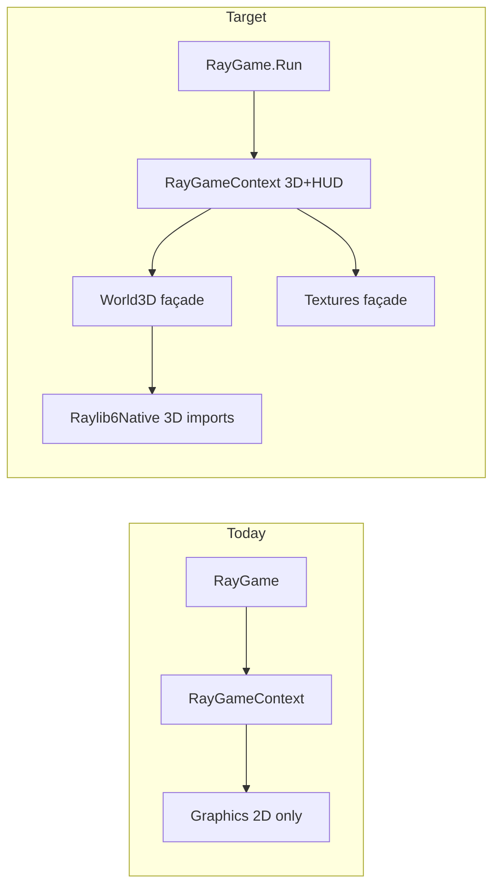

# X-Fighter sample (XWA-style cockpit combat)

## Current blocker

The repo only binds **2D** raylib APIs today ([`pipeline/raylib6/raylib-exports.manifest.json`](pipeline/raylib6/raylib-exports.manifest.json) has ~40 imports; no `BeginMode3D`, `DrawCube`, textures, or cursor lock). [`Vector3`](src/Novolis.Raylib.Runtime/Transformations/Vector3.cs) exists manually, but nothing calls into 3D.



**Realism expectations:** “Super realistic” here means **arcade-sim fidelity** within raylib defaults: 1920×1080, MSAA (`WindowStateFlags.DefaultGameHost`), lit 3D primitives, depth-cued enemies, engine glow, laser trails, explosions, and a **high-res cockpit overlay PNG** (transparent center viewport)—not full X-Wing Alliance parity (licensed IP, years of art/shaders, physics). Original naming only: **X-Fighter** / **H-Fighter**.

---

## Phase 1 — 3D + texture codegen (required foundation)

### 1a. Structs (hand-written in Runtime, blittable)

Add to [`src/Novolis.Raylib.Runtime/`](src/Novolis.Raylib.Runtime/):

| Type | Purpose |
|------|---------|
| `Camera3D` | position, target, up, fovy, projection (`int`) — matches [`raylib.h`](vendor/raylib-6/include/raylib.h) |
| `Raylib6NativeTexture` | `uint id`, `int width/height`, `int mipmaps`, `int format` (for interop return types) |

### 1b. New interop templates + manifest rows

Extend [`RaylibInteropEmitter.cs`](src/Novolis.Raylib.CodeGen/Emit/RaylibInteropEmitter.cs) templates, then add imports to [`raylib-exports.manifest.json`](pipeline/raylib6/raylib-exports.manifest.json):

**3D world**

- `BeginMode3D` / `EndMode3D`
- `DrawCube`, `DrawCubeV`, `DrawCubeWiresV` (H-Fighter hull from boxes)
- `DrawSphere`, `DrawSphereWires` (bolts, explosions)
- `DrawLine3D`, `DrawCylinder` (laser bolts, engine plumes)
- `DrawGrid` (optional debug)

**Input / window**

- `DisableCursor`, `EnableCursor`, `SetMousePosition`

**Textures / HUD**

- `LoadTexture`, `UnloadTexture`, `IsTextureValid`
- `DrawTexturePro` (cockpit overlay)
- `DrawTexture` (optional HUD icons)

Run `dotnet run --project src/Novolis.Raylib.CodeGen -- generate` and commit `*.g.cs` + manifest (CI drift check).

### 1c. New façades in [`facades.manifest.json`](pipeline/raylib6/facades.manifest.json)

- **`World3D`** (`Novolis.Raylib.Rendering`) — thin forwards to `Raylib6Native` for all 3D draw calls + `BeginMode3D`/`EndMode3D`
- **`Textures`** (`Novolis.Raylib.Rendering`) — load/draw/unload; wrap native texture struct in a small managed `Texture` handle type in hand-written code if needed

### 1d. Flight keyboard keys

Extend [`KeyboardKey.cs`](src/Novolis.Raylib.Runtime/Interact/KeyboardKey.cs) with `W`, `A`, `S`, `D`, `Space`, `LeftShift`, `LeftControl`, `R`, `Tab` (raylib key ints from `raylib.h`).

---

## Phase 2 — Extend `RayGame` for 3D cockpit games

Update [`RayGameContext`](src/Novolis.Raylib.Game/RayGame.cs) with jam-friendly wrappers (used by X-Fighter):

| Method | Behavior |
|--------|----------|
| `BeginWorld3D(Camera3D camera)` / `EndWorld3D()` | Delegates to `World3D` |
| `DrawShipBox(Vector3 pos, Vector3 size, Color color)` | `DrawCubeV` |
| `DrawBolt(Vector3 from, Vector3 to, Color color)` | `DrawLine3D` or thin cylinder |
| `DrawHudTexture(Texture cockpit, Rectangle dest)` | `DrawTexturePro` full-screen |
| `HudText` / `HudRect` | Existing 2D helpers (post-`EndWorld3D`) |
| `Input` accessors | `IsKeyDown`, mouse delta, `DisableCursor` on first frame via game init |

Keep [`RayGame.Run`](src/Novolis.Raylib.Game/RayGame.cs) as entry; game loop stays `Action<RayGameContext>`.

Optional: add `RayGame.Run(title, width, height, Action<RayGameContext> init, Action<RayGameContext> update)` for one-time setup (load textures, lock cursor)—or use a `static` game class with `Initialized` flag inside the lambda.

---

## Phase 3 — `samples/XFighter` project

Add to [`Novolis.Raylib.slnx`](Novolis.Raylib.slnx):

```
samples/XFighter/
  XFighter.csproj          → ProjectReference Novolis.Raylib
  Program.cs               → RayGame.Run("X-Fighter", 1920, 1080, game.Update)
  Game/
    XFighterGame.cs        → state machine, spawn waves
    PlayerFlight.cs        → mouse pitch/yaw, WASD throttle, inertia
    HFighter.cs            → enemy entity (procedural H-shape from cubes)
    CombatSystem.cs        → lasers, hit tests, explosions
    Starfield.cs           → 3D star points + parallax
    CockpitHud.cs          → overlay texture + crosshair, radar, shield bar
  Assets/
    cockpit_overlay.png    → 1920×1080 PNG, alpha window in center (bundled as Content CopyToOutputDirectory)
    README.txt             → controls (in-asset folder, not root markdown)
```

### Gameplay (minimum shippable)

- **Camera:** first-person from cockpit; `Camera3D` at player origin, orientation driven by mouse delta (cursor disabled).
- **Movement:** `W`/`S` throttle along forward vector; slight drag; bounded speed.
- **Weapons:** `Space` or LMB fires forward laser bolts at fire rate; bolts move in world space.
- **H-Fighters:** spawn in front arc at distance; weave toward player; procedural “H” silhouette (wings + cockpit cube, gray hull, red engine spheres).
- **Hits:** sphere hit-test (bolt vs enemy radius); on kill → brief explosion spheres + remove entity; score counter on HUD.
- **Rendering order per frame:**
  1. `ClearBackground` (dark space color)
  2. `BeginWorld3D` → starfield + enemies + bolts + explosions
  3. `EndWorld3D`
  4. `DrawHudTexture` cockpit overlay
  5. HUD text (score, “H-Fighter” kill feed, control hints)

### Cockpit asset

Ship one **authored PNG** (not Lucasfilm art): metallic frame, side consoles, center transparent viewport, vignette. If no artist asset is available, generate a plausible overlay programmatically once (dark panels + beveled rects) and save to `Assets/`—still reads as “high-res cockpit” at 1080p.

---

## Phase 4 — Verification

1. **Manual:** `dotnet run --project samples/XFighter` — fly, shoot, destroy multiple H-Fighters.
2. **Visual capture:** add [`VisualSmokeCaptureTests`](tests/Novolis.Raylib.Testing.Integration/VisualSmokeCaptureTests.cs)-style test or dedicated `XFighterCaptureTests` that runs one scripted frame (fixed camera, one enemy, one bolt) via offscreen harness → `artifacts/visual-captures/xfighter-combat.png` for agent/human review.
3. **Unit (light):** pure C# tests for `CombatSystem` hit detection math (no native).

---

## Files touched (summary)

| Area | Files |
|------|-------|
| Codegen | `raylib-exports.manifest.json`, `facades.manifest.json`, `RaylibInteropEmitter.cs`, generated `Raylib6Native.g.cs`, `World3D.g.cs`, `Textures.g.cs` |
| Runtime | `Camera3D.cs`, `Texture.cs` (handle), `KeyboardKey.cs` |
| Game API | `RayGame.cs` (`RayGameContext` extensions) |
| Sample | `samples/XFighter/**`, `Novolis.Raylib.slnx` |
| Tests | `tests/.../XFighterCaptureTests.cs` (optional split from smoke test) |

---

## Out of scope (defer)

- Full `LoadModel` / `.obj` ships (Model struct marshalling is large; procedural cubes deliver playable H-Fighters faster)
- Custom GLSL shaders / post-processing bloom
- Multiplayer, mission scripting, targeting computer à la XWA
- Audio weapons SFX (only `AudioDevice` init exists today)

---

## Risk / mitigation

| Risk | Mitigation |
|------|------------|
| Codegen template churn | Add only templates needed for listed APIs; verify with `raylib-codegen-check.ps1` |
| Cockpit PNG missing | Fallback: draw procedural 2D frame until asset lands |
| Mouse capture on CI | Visual test uses offscreen harness; gameplay test is manual/local |
| FPS overlay clashes with HUD | Hide `DrawFPS` in shell when `RayGame` runs, or draw HUD after shell’s FPS (prefer small change in [`RaylibRuntimeShell`](src/Novolis.Raylib.Runtime/Shell/RaylibRuntimeShell.cs): skip FPS if env flag or delegate parameter) |
