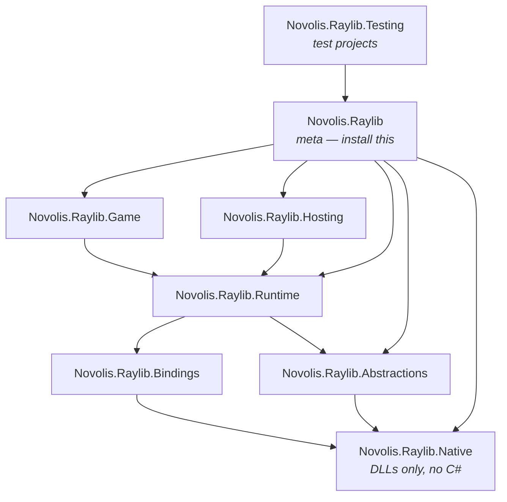

# Novolis.Raylib

Multi-package .NET bindings for [raylib](https://www.raylib.com/) 6 + raygui.

## Install

```bash
dotnet add package Novolis.Raylib
```

Test projects:

```bash
dotnet add package Novolis.Raylib.Testing
```

## Packages

All publishable packages live under `src/`. Install **`Novolis.Raylib`** for games and apps; it pulls the rest transitively. Do **not** reference `Novolis.Raylib.Native` or `Novolis.Raylib.Abstractions` directly unless you have a special reason.



| Package | Role | Depends on |
|---------|------|------------|
| **Novolis.Raylib** | Meta package — one install for the full stack | Game, Hosting, Runtime, Abstractions, Native |
| **Novolis.Raylib.Game** | `RayGame.Run` jam API | Runtime |
| **Novolis.Raylib.Hosting** | `IHost` + phased systems (`IRenderSystem`, …) | Runtime |
| **Novolis.Raylib.Runtime** | Window shell, logging, debug, raygui host, framebuffer capture | Bindings, Abstractions, Native (assets) |
| **Novolis.Raylib.Bindings** | Generated P/Invoke + façades (`Graphics`, `World3D`, …); shared blittable types | Native (assets) |
| **Novolis.Raylib.Abstractions** | Frame/shell contracts (transitive) | Native (assets) |
| **Novolis.Raylib.Native** | `raylib` + `novolis_raygui` binaries per RID (no managed code) | — |
| **Novolis.Raylib.Testing** | Offscreen harness, deterministic clock (tests only) | Novolis.Raylib |

**Native assets:** `Novolis.Raylib.Native` packs prebuilt `raylib` from `vendor/` plus `novolis_raygui` built by the maintainer pipeline (`dotnet run pipeline/raylib6/run.cs native`). That is separate from the **`native`** CMake step and from **`Novolis.Raylib.Bindings`**, which holds the C# interop.

**Not published:** Roslyn codegen under `codegen/` (see [docs/codegen.md](docs/codegen.md)).

## Quick start (Game)

```csharp
using Novolis.Raylib.Colors;
using Novolis.Raylib.Game;

RayGame.Run("Demo", 800, 600, ctx =>
{
    ctx.Clear(RaylibColors.RayWhite);
    ctx.Text("Hello", 12, 12, 20, RaylibColors.DarkGray);
});
```

## Maintainer pipeline

```bash
dotnet run pipeline/raylib6/run.cs all   # fetch + native + codegen
dotnet build Novolis.Raylib.slnx
./scripts/raylib-codegen-check.ps1
```

See [docs/codegen.md](docs/codegen.md) and [docs/testing.md](docs/testing.md).
