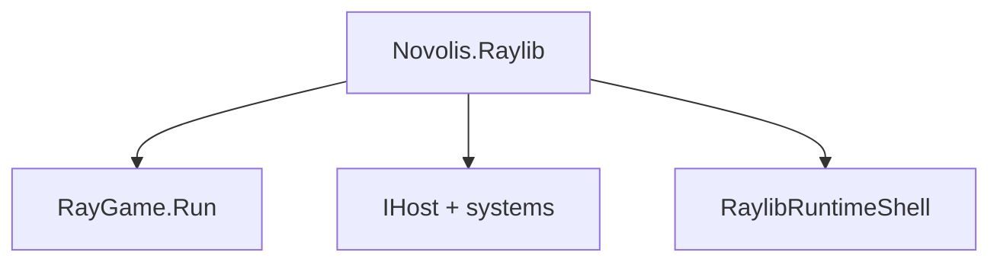

# Getting started with Novolis.Raylib

Novolis.Raylib is a multi-package .NET 10 binding for [raylib](https://www.raylib.com/) 6 and raygui.

## Install

```bash
dotnet add package Novolis.Raylib
```

For test projects:

```bash
dotnet add package Novolis.Raylib.Testing
```

## Pick an entry API



| Use case | API | Sample |
|----------|-----|--------|
| Jam / prototype | `Novolis.Raylib.Game` → `RayGame.Run` | `samples/HelloGame` |
| DI / phased loop | `Novolis.Raylib.Hosting` → `AddRaylib`, `IRenderSystem` | `samples/HelloHosting` |
| Low-level control | `Graphics`, `World`, `Hud`, `Gui` | `samples/HelloRuntime` |
| Automated tests | `Novolis.Raylib.Testing` | `samples/HelloTesting` |

Do **not** add direct package references to `Novolis.Raylib.Native` or `Novolis.Raylib.Abstractions` unless you extend the stack.

## Drawing model

Within one frame:

1. `Graphics.BeginDrawing()`
2. Optional 3D: `World.Begin(camera)` … `World.End()`
3. Optional 2D overlay: `Hud.*`
4. Optional UI: `Gui.*` (raygui, UTF-8)
5. `Graphics.EndDrawing()`

## Headless and CI

| Variable | Effect |
|----------|--------|
| `NOVOLIS_RAYLIB_HEADLESS=1` | Skip blocking window loop |
| `NOVOLIS_RAYLIB_OFFSCREEN_TESTS=1` | Enable test harness |
| `NOVOLIS_RAYLIB_NATIVE_TESTS=1` | Load native DLLs in tests |

## Learn raylib concepts

Façade methods map to raylib C APIs. When you need parameter semantics, use the [raylib cheatsheet](https://www.raylib.com/cheatsheet/cheatsheet.html) and [raylib wiki](https://github.com/raysan5/raylib/wiki).

## Package READMEs

- [Novolis.Raylib](../src/Novolis.Raylib/README.md)
- [Game](../src/Novolis.Raylib.Game/README.md)
- [Hosting](../src/Novolis.Raylib.Hosting/README.md)
- [Runtime](../src/Novolis.Raylib.Runtime/README.md)
- [Testing](../src/Novolis.Raylib.Testing/README.md)

Maintainers: [codegen.md](codegen.md), [testing.md](testing.md).
